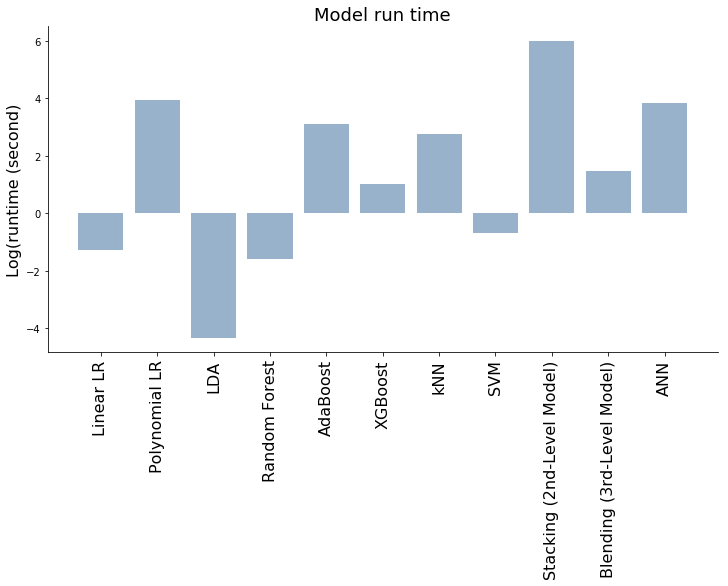

## Contents
{:.no_toc}
*  
{: toc}

## Data cleaning

In this part, we import datasets from previous section, split the dataset into training and test set and do data cleaning  by normalizing data in each columns. The feature we used here include feature we extracted from NLP.

```python
user_df = pd.read_csv(r"merged_mean_imputed_legit.csv",index_col='User ID')
bot_df = pd.read_csv(r"merged_mean_imputed_bots.csv",index_col='User ID')
# pre_df=pd.read_csv(r"pred_dataframe.csv",index_col='User ID')
bot_df['bot']=1
user_df['bot']=0
total_df = bot_df.append(user_df)
```

```python
total_df=total_df.drop(['bot_bool','Account age (days)','avg_num_caps', 'avg_words_per_tweet','word_diversity', 'difficult_words_score','avg_readability_combined_metric','avg_flesch_reading_ease', 'avg_readability_DC', 'full_tweet_text','avg_num_hashtags.1','percent_with_p_emoji','percent_with_n_emoji','percent_with_pn_emoji','avg_num_exclamation','avg_num_ellipses'],axis=1)
total_df=pd.get_dummies(total_df, prefix=['overall_language'], columns=['overall_language'])
```

```python
train_data, test_data = train_test_split(total_df, test_size = 0.3, random_state=99)
Y_train=train_data['bot']
Y_test=test_data['bot']
X_train=train_data.drop('bot',axis=1)
X_test=test_data.drop('bot',axis=1)
```

```python
X_test=X_test.replace([np.inf, -np.inf], np.nan).dropna()
X_train=X_train.replace([np.inf, -np.inf], np.nan).dropna()
```


```python
def normalize(df,df_train):
    result = df.copy()
    for feature_name in df_train.columns:
        max_value = df_train[feature_name].max()
        min_value = df_train[feature_name].min()
        result[feature_name] = (df[feature_name] - min_value) / (max_value - min_value)
    return result
```


```python
X_train_scaled=normalize(X_train,X_train)
X_test_scaled=normalize(X_test,X_train)
X_train_scaled=X_train_scaled.drop(['overall_language_bg','overall_language_fa','overall_language_lv','overall_language_lv','overall_language_sw'],axis=1)
X_test_scaled=X_test_scaled.drop(['overall_language_bg','overall_language_fa','overall_language_lv','overall_language_lv','overall_language_sw'],axis=1)
```


## Models  with  NLP Features

Similar to the those used in the model development section, we also implement logistic regression, LDA/QDA, random forest, boosting, and support vector machine models.

Two major improvements from what we did in the model development section are:

- Include NLP features into these models

- Include feed forward artificial neural network, support vector machine, stacking (meta ensembling) and blending models.

### Logistic Regression

As in the model development setion, we run a logistic regression model using standard features, and then a model incorporating polynomial features with interactions and cross-validation.

```python
start_time = time.time()
logreg = LogisticRegression(C=100000,fit_intercept=True).fit(X_train_scaled,Y_train)
time_logistic=time.time() - start_time
logreg_train = logreg.score(X_train_scaled, Y_train)
logreg_test = logreg.score(X_test_scaled, Y_test)
print('Accuracy of logistic regression model on the test set is {:.3f}'.format(logreg_test))
```


    Accuracy of logistic regression model on the test set is 0.972


```python
# Logistic regression w/ quadratic + interaction terms + regularization
start_time = time.time()
polynomial_logreg_estimator = make_pipeline(
    PolynomialFeatures(degree=2, include_bias=True),
    LogisticRegressionCV(multi_class="ovr", penalty='l2', cv=5, max_iter=10000))
linearLogCVpoly = polynomial_logreg_estimator.fit(X_train_scaled, Y_train)
time_linearLogCVpoly=time.time() - start_time

# Compare results
print('Polynomial-logistic accuracy:test={:.1%}'.format( linearLogCVpoly.score(X_test_scaled, Y_test)))

linearLogCVpoly_train = linearLogCVpoly.score(X_train_scaled, Y_train)
linearLogCVpoly_test = linearLogCVpoly.score(X_test_scaled, Y_test)
```


    Polynomial-logistic accuracy:test=96.9%


```python
y_pred_logreg= logreg.predict(X_test_scaled)
y_pred_logreg_proba=logreg.predict_proba(X_test_scaled)[:,1]
y_pred_linearLogCVpoly= linearLogCVpoly.predict(X_test_scaled)
y_pred_linearLogCVpoly_proba=linearLogCVpoly.predict_proba(X_test_scaled)[:,1]
```


### LDA and QDA Model


```python
start_time = time.time()
lda = LinearDiscriminantAnalysis(store_covariance=True)
lda.fit(X_train_scaled, Y_train)
time_lda=time.time() - start_time
print("---lda %s seconds ---" % (time_lda))

start_time = time.time()
qda = QuadraticDiscriminantAnalysis(store_covariance=True)
qda.fit(X_train_scaled, Y_train)
time_qda=time.time() - start_time
print("--- qda %s seconds ---" % (time_qda))

y_pred_lda=lda.predict(X_test_scaled)
y_pred_lda_proba=lda.predict_proba(X_test_scaled)[:,1]

y_pred_qda=qda.predict(X_test_scaled)
lda_train = lda.score(X_train_scaled, Y_train)
lda_test = lda.score(X_test_scaled, Y_test)
qda_train = qda.score(X_train_scaled, Y_train)
y_pred_qda_proba=qda.predict_proba(X_test_scaled)[:,1]

qda_test = qda.score(X_test_scaled, Y_test)

print('LDA accuracy train={:.1%}, test: {:.1%}'.format(
    lda.score(X_train_scaled, Y_train), lda.score(X_test_scaled, Y_test)))

print('QDA accuracy train={:.1%}, test: {:.1%}'.format(
    qda.score(X_train_scaled, Y_train), qda.score(X_test_scaled, Y_test)))
```


    ---lda 0.013133764266967773 seconds ---
    --- qda 0.008303165435791016 seconds ---
    LDA accuracy train=94.5%, test: 93.2%
    QDA accuracy train=72.8%, test: 72.3%


Interestingly, the QDA model performs much worse than the LDA and other models. This is interesting because it is often the other way around, with LDA performing worse than QDA. One factor that could account for this is the fact that the majority of the classification boundaries in the feature space are approximately linear and are better predicted using LDA.

### Random forest

Our random forest model performed very well when using the standard user metadata features in the model development section, lets see how well it performs with our new NLP features.

```python
start_time = time.time()
ntrees = 50
rf = RandomForestClassifier(n_estimators=ntrees , max_depth=15, max_features='auto')
rf.fit(X_train_scaled, Y_train)

time_rf=time.time() - start_time
print("--- %s seconds ---" % (time_rf))

rf_train =rf.score(X_train_scaled, Y_train)
rf_test =rf.score(X_test_scaled, Y_test)
rf_y_test_proba =rf.predict_proba(X_test_scaled)[:,1]
rf_y_test =rf.predict(X_test_scaled)
print('RF accuracy train={:.1%}, test: {:.1%}'.format(rf_train,rf_test))
# y_pre_df_rf = rf.predict(pre_df_scaled)
```


    --- 0.20110392570495605 seconds ---
    RF accuracy train=100.0%, test: 98.4%

Random forest appears to perform very well, in fact, it will be difficult to find a model which is able to obtain better predictions than this given such a high accuracy on the test set.


### Adaboost


```python
start_time = time.time()

adaboost = AdaBoostClassifier(base_estimator=DecisionTreeClassifier(max_depth=8), n_estimators=800, learning_rate=0.01)
adaboost.fit(X_train_scaled, Y_train);
time_adaboost=time.time() - start_time
print("--- %s seconds ---" % (time_adaboost))
```


    --- 22.391461849212646 seconds ---


```python
y_pred_test = adaboost.predict(X_test_scaled)
pred_adaboost = [round(value) for value in y_pred_test]
test_adaboost = accuracy_score(Y_test, pred_adaboost)
print('test acc:',test_adaboost )
y_train_adaboost = adaboost.predict(X_train_scaled)
train_adaboost = accuracy_score(Y_train,y_train_adaboost)
y_test_adaboost = adaboost.predict(X_test_scaled)
y_test_adaboost_proba = adaboost.predict_proba(X_test_scaled)[:,1]

```


    test acc: 0.9715346534653465


### XGBoost


```python
start_time = time.time()
xgb = xgb.XGBClassifier(max_depth=5, n_estimators=300, learning_rate=0.01).fit(X_train_scaled, Y_train)
time_xgb=time.time() - start_time
print("--- %s seconds ---" % (time_xgb))

y_pred_train_xgb = xgb.predict(X_train_scaled)
y_pred_test_xgb = xgb.predict(X_test_scaled)
y_pred_test_xgb_proba = xgb.predict_proba(X_test_scaled)[:,1]

test_xgb = accuracy_score(Y_test, y_pred_test_xgb)
train_xgb = accuracy_score(Y_test, y_pred_test_xgb)

print("test Accuracy: %.2f%%" % (accuracy_xgb * 100.0))

# y_pre_df_xgboost = xgb.predict(pre_df_scaled)
```


    --- 2.7918081283569336 seconds ---
    test Accuracy: 98.27%

XGBoost performs almost as well as our random forest model, but is almost 10x slower.

### K-NN


```python
start_time = time.time()

scores_mean=[]
scores_std=[]
k_number=np.arange(1,40)
for k in range(1,40):
    knn = KNeighborsClassifier(n_neighbors = k)
    score_mean= cross_val_score(knn,X_train_scaled,Y_train,cv=5).mean()
    score_std=cross_val_score(knn,X_train_scaled,Y_train,cv=5).std()
    scores_mean.append(score_mean)
max_score_k=max(scores_mean)
best_k=scores_mean.index(max(scores_mean))+1
print('Best K=',best_k, 'with a max CV score of',max_score_k)

knn_best_k = KNeighborsClassifier(n_neighbors = best_k)
knn_best_k.fit(X_train_scaled,Y_train);

time_knn_best_k=time.time() - start_time
print("--- %s seconds ---" % (time_knn_best_k))

y_test_pred_best_k = knn_best_k.predict(X_test_scaled)
y_train_pred_best_k = knn_best_k.predict(X_train_scaled)
y_test_pred_best_k_proba = knn_best_k.predict_proba(X_test_scaled)[:,1]

train_knn_best_k= knn_best_k.score(X_train_scaled, Y_train)
test_knn_best_k= knn_best_k.score(X_test_scaled, Y_test)

print('train accuracy',accuracy_score(Y_train, y_train_pred_best_k))
print('test accuracy',accuracy_score(Y_test, y_test_pred_best_k))
```


    Best K= 4 with a max CV score of 0.9522094926350245
    --- 15.47924017906189 seconds ---
    train accuracy 0.9681359532660648
    test accuracy 0.9492574257425742

KNN performs surprisingly well on the test set, although the value of K that provides the optimal result is lower than one might expect at first. This could be due to the large number of features and relatively small amount of data in comparison to the large feature space. As one might suspect, the model takes a lot longer than most of the other models to calculate because of the large number of calculations required for each data point.

### Support Vector Machines

The support vector machine shold perform relatively well because the feature space has a large number of features that are partially linearly separable. This indicates that an optimal placement of the hyperplane in the feature space should allow us to obtain a high predictive accuracy.

```python
def fit_and_plot_svm_for_c(x_train, y_train, x_test, y_test,pre_df, C):
    # Fit SVM model
    model = svm.SVC(C=C, kernel='linear',probability=True)
    model.fit(x_train, y_train)

    # Train and test error

    tr_acc = model.score(x_train, y_train)
    ts_acc = model.score(x_test, y_test)
    y_pre_svm = model.predict(pre_df)
    y_pre_svm_proba = model.predict_proba(pre_df)[:,1]

    return tr_acc, ts_acc,y_pre_svm,y_pre_svm_proba
```

```python
# Fit and plot for different 'C' values
start_time = time.time()
tr_acc, ts_acc,y_pre_test_svm,y_pre_svm_proba = fit_and_plot_svm_for_c(X_train_scaled, Y_train,X_test_scaled, Y_test, X_test_scaled, 0.1)
time_svm=time.time() - start_time
print("--- %s seconds ---" % (time_svm))
```


    --- 0.4933969974517822 seconds ---

```python
print('train accuracy',tr_acc)
print('test accuracy',ts_acc)
```


    train accuracy 0.9251194901752523
    test accuracy 0.9133663366336634

The support vector machine did not do as well as the other models. This could be improved by trying different values for the regularization coefficients, as well as altering the kernel and adding polynomial features as done for the logistic regression model.


### Artificial Neural network (ANN)


In this section, we development Artificial neural network based on TensorFlow.
Neural Networks consist of the following components:

- An input layer, $X$
- An arbitrary amount of hidden layers
- An output layer, $y$
- A set of weights and biases between each layer, $W$ and $b$
- A choice of activation function for each hidden layer, $\sigma$.


Here we built a three-layers ANN based on GridsearchCV results :
We run the ANN with  GridsearchCV  for 3-5 layers, a list of  different optimizer in the hidden layers, learn_rate for each optimizer, loss functions , batch size and epochs for when we train the model without NLP features.

Optimizer=['SGD', 'RMSprop', 'Adagrad', 'Adadelta', 'Adam', 'Adamax', 'Nadam']
batch_size = [10, 20, 60, 80, 100,128,250,500]
epochs =[10, 100,500,800,1000,1500,2000]
learn_rate = [0.001, 0.01, 0.1, 0.2, 0.3]

 For these models, it takes two days to run as the GridSearchCV is an exhaustive search.  As the time constraint, we did not do the GridSearchCV when we train the model with new features. We just simply apply to best ANN architecture from previous experience.

 Here is the ANN architecture is we adopted:
1. Nodes per Layer: 500, 300, 2
2. Activation function: reLU
3. Loss function: `binary_crossentropy`
4. Output unit: Sigmoid
5. Optimizer: Adam
6. Epochs: 500
7. Batch size: 128
8. Validation size: 0.2
9. regularization: L2 and dropout

Adam is a popular algorithm in the field of deep learning because it achieves good results fast.It is an algorithm for first-order gradient-based optimization of stochastic objective functions, based on adaptive estimates of lower-order moments.

```python
start_time=time.time()
model_NN = models.Sequential()

model_NN.add(layers.Dense(500, input_shape=(X_train_scaled.shape[1],),
                activation='relu'))

model_NN.add(layers.Dense(300, input_shape=(X_train_scaled.shape[1],),
                activation='relu',
                kernel_regularizer=regularizers.l2(0.01)))
model_NN.add(Dropout(0.5))

model_NN.add(layers.Dense(1,  
                activation='sigmoid'))

print(model_NN.summary())
tensorflow.keras.optimizers.Adam(lr=0.01, beta_1=0.9, beta_2=0.999, epsilon=None, decay=0.0, amsgrad=False)
model_NN.compile(loss='binary_crossentropy', optimizer='Adam', metrics=['accuracy'])
```


    _________________________________________________________________
    Layer (type)                 Output Shape              Param #   
    =================================================================
    dense_13 (Dense)             (None, 500)               25500     
    _________________________________________________________________
    dense_14 (Dense)             (None, 300)               150300    
    _________________________________________________________________
    dropout_5 (Dropout)          (None, 300)               0         
    _________________________________________________________________
    dense_15 (Dense)             (None, 1)                 301       
    =================================================================
    Total params: 176,101
    Trainable params: 176,101
    Non-trainable params: 0
    _________________________________________________________________
    None


```python
%%capture
start_time=time.time()
ANN_history = model_NN.fit(X_train_scaled, Y_train,batch_size=128,epochs=500,validation_split=0.2)
time_ANN=time.time() - start_time
```

```python
train_loss,train_acc = model_NN.evaluate(X_train_scaled, Y_train, verbose=1)
test_loss,test_acc = model_NN.evaluate(X_test_scaled, Y_test, verbose=1)
print('Test loss:', test_loss)
print('Test ACC:', test_acc)
y_pre_test_NN_proba = model_NN.predict(X_test_scaled)
y_pre_test_NN= np.array((y_pre_test_NN_proba>0.5).astype(np.int))[:,0]
training_loss = ANN_history.history['loss']
epoch_count = range(1, len(training_loss) + 1)
fig, axs = plt.subplots(figsize=(8, 6))

plt.plot(epoch_count, training_loss, 'r--')
plt.legend(['Training Loss'])
plt.xlabel('Epoch')
plt.ylabel('Loss')
plt.show();
fig, axs = plt.subplots(figsize=(8, 6))
plt.plot(ANN_history.history['acc'], '-o', label='train')
plt.plot(ANN_history.history['val_acc'], '-*', label='val')

plt.ylabel("Accuracy score")
plt.xlabel("Epoch")
plt.title("Accuracy score vs. Epochs")

plt.legend()
plt.show()
```


    1883/1883 [==============================] - 0s 45us/step
    808/808 [==============================] - 0s 42us/step
    Test loss: 0.13090957977836676
    Test ACC: 0.9789603960396039


{: .center}


{: .center}


We see that the neural network takes a long time to train but performs comparably well to the best models that have been implemented. Given the features we used for the final ANN model are different and also the observation size is different when we perform the GridSearchCV. The ANN architecture may not be the best. However, due to time constraint, we are not able to do the exhaustive search for the ANN with NLP features. We also tried to increased adding more hidden layers and/or more nots. however, it tends to overfit when adding more layer and more nots.  Higher score can be achieved if we did the GridSearchCV for the ANN with NLP features.

### Stacked Model

Model stacking is an efficient ensemble method in which the predictions, generated by using various machine learning algorithms, are used as inputs in a second-layer learning algorithm. This second-layer algorithm is trained to optimally combine the model predictions to form a new set of predictions. For example, when linear regression is used as second-layer modeling, it estimates these weights by minimizing the least square errors. However, the second-layer modeling is not restricted to only linear models; the relationship between the predictors can be more complex, opening the door to employing other machine learning algorithms.

Ensemble modeling and model stacking are especially popular in data science competitions, in which a sponsor posts a training set (which includes labels) and a test set (which does not include labels) and issues a global challenge to produce the best predictions of the test set for a specified performance criterion. The winning teams almost always use ensemble models instead of a single fine-tuned model. Often individual teams develop their own ensemble models in the early stages of the competition, and then join their forces in the later stages.

A simple way to enhance diversity is to train models by using different machine learning algorithms. For example, adding a factorization model to a set of tree-based models (such as random forest and gradient boosting) provides a nice diversity because a factorization model is trained very differently than decision tree models are trained. For the same machine learning algorithm, you can enhance diversity by using different hyperparameter settings and subsets of variables. If you have many features, one efficient method is to choose subsets of the variables by simple random sampling.

Overfitting is an especially big problem in model stacking, because so many predictors that all predict the same target are combined. Overfitting is partially caused by this collinearity between the predictors. The most efficient techniques for training models (especially during the stacking stages) include using cross validation and some form of regularization.

Applying stacked models to real-world big data problems can produce greater prediction accuracy and robustness than do individual models. The model stacking approach is powerful and compelling enough to alter your initial data mining mindset from finding the single best model to finding a collection of really good complementary models. Of course, this method does involve additional cost both because you need to train a large number of models and because you need to use cross validation to avoid overfitting.

In this section we will try to implement a stacked model similar to that proposed in the "[Stacked Ensemble Models for Improved Prediction Accuracy](https://support.sas.com/resources/papers/proceedings17/SAS0437-2017.pdf)" paper.

#### Helpers via Python Classes

In the section of code, we write a class `SklearnHelper` that allows one to extend the inbuilt methods (such as train, predict and fit) common to all the Sklearn classifiers. Therefore this cuts out redundancy as won't need to write the same methods five times if we wanted to invoke five different classifiers.


```python
# Some useful parameters which will come in handy later on
ntrain = X_train_scaled.shape[0]
ntest = X_test_scaled.shape[0]
# n_pre_df=pre_df_scaled.shape[0]
SEED = 99 # for reproducibility
NFOLDS = 5 # set folds for out-of-fold prediction

kf = KFold(n_splits = NFOLDS, random_state=SEED)

# Class to extend the Sklearn classifier
class SklearnHelper(object):
    def __init__(self, clf, seed=0, params=None):
        params['random_state'] = seed
        self.clf = clf(**params)

    def train(self, x_train, y_train):
        self.clf.fit(x_train, y_train)

    def predict(self, x):
        return self.clf.predict(x)

    def fit(self,x,y):
        return self.clf.fit(x,y)

    def feature_importances(self,x,y):
            print(self.clf.fit(x,y).feature_importances_)
```

 Essentially, we have created a wrapper class to extend the various Sklearn classifiers so that this should help us reduce having to write the same code over and over when we implement multiple learners to our stacker.

#### Out-of-Fold Predictions

Stacking uses predictions of base classifiers as input for training to a second-level model. However one cannot simply train the base models on the full training data, generate predictions on the full test set and then output these for the second-level training. This runs the risk of your base model predictions already having "seen" the test set and therefore overfitting when feeding these predictions.


```python
def get_oof(clf, x_train, y_train, x_test):
    oof_train = np.zeros((ntrain,))
    oof_test = np.zeros((ntest,))
    oof_test_skf = np.empty((NFOLDS, ntest))

    for i, (train_index, test_index) in enumerate(kf.split(x_train)):

        x_tr = x_train.iloc[train_index]
        y_tr = y_train.iloc[train_index]
        x_te = x_train.iloc[test_index]
        clf.train(x_tr, y_tr)

        oof_train[test_index] = clf.predict(x_te)
        oof_test_skf[i, :] = clf.predict(x_test)

    oof_test[:] = oof_test_skf.mean(axis=0)
    return oof_train.reshape(-1, 1), oof_test.reshape(-1, 1)
```


#### Generating our Base First-Level Models

So now let us prepare five learning models as our first level classification. These models can all be conveniently invoked via the Sklearn library and are listed as follows:

- **Random Forest classifier**
- **Extra Trees classifier**
- **AdaBoost classifer**
- **Gradient Boosting classifer**
- **Support Vector Machine**

**Parameters**

**n_jobs :** Number of cores used for the training process. If set to -1, all cores are used.

**n_estimators :** Number of classification trees in your learning model ( set to 10 per default)

**max_depth :** Maximum depth of tree, or how much a node should be expanded. Beware if set to too high a number would run the risk of overfitting as one would be growing the tree too deep

**verbose :** Controls whether you want to output any text during the learning process. A value of 0 suppresses all text while a value of 3 outputs the tree learning process at every iteration.


```python
# Create 5 objects that represent our 4 models
# Put in our parameters for said classifiers
# Random Forest parameters

rf_params = {
    'n_jobs': -1,
    'n_estimators': 50,
     'warm_start': True,
     #'max_features': 0.2,
    'max_depth': 15,
    'min_samples_leaf': 2,
    'max_features' : 'sqrt',
    'verbose': 0
}


# Extra Trees Parameters
et_params = {
    'n_jobs': -1,
    'n_estimators':500,
    #'max_features': 0.5,
    'max_depth': 4,
    'min_samples_leaf': 2,
    'verbose': 0
}

# AdaBoost parameters
ada_params = {
    'base_estimator': DecisionTreeClassifier(max_depth=5),
    'n_estimators': 800,
    'learning_rate' : 0.01
}

# Gradient Boosting parameters
gb_params = {
    'n_estimators': 500,
     #'max_features': 0.2,
    'max_depth': 5,
    'min_samples_leaf': 2,
    'verbose': 0
}

# Support Vector Classifier parameters
svc_params = {
    'kernel' : 'sigmoid',
    'C' : 0.1
    }
```


Let us now create 5 objects that represent our 5 learning models via our Helper Sklearn Class we defined earlier.


```python
# Create 5 objects that represent our 4 models
rf = SklearnHelper(clf=RandomForestClassifier, seed=SEED, params=rf_params)
et = SklearnHelper(clf=ExtraTreesClassifier, seed=SEED, params=et_params)
ada = SklearnHelper(clf=AdaBoostClassifier, seed=SEED, params=ada_params)
gb = SklearnHelper(clf=GradientBoostingClassifier, seed=SEED, params=gb_params)
svc = SklearnHelper(clf=SVC, seed=SEED, params=svc_params)
logreg_stack = SklearnHelper(clf=LogisticRegression, seed=SEED, params=logreg_params)
```


#### Output of the First level Predictions

We now feed the training and test data into our 5 base classifiers and use the Out-of-Fold prediction function we defined earlier to generate our first level predictions. Allow a handful of minutes for the chunk of code below to run.


```python
# Create our OOF train and test predictions. These base results will be used as new features
start_time = time.time()
et_oof_train, et_oof_test = get_oof(et, X_train_scaled, Y_train, X_test_scaled) # Extra Trees
rf_oof_train, rf_oof_test = get_oof(rf,X_train_scaled, Y_train, X_test_scaled) # Random Forest
ada_oof_train, ada_oof_test = get_oof(ada, X_train_scaled, Y_train, X_test_scaled) # AdaBoost
gb_oof_train, gb_oof_test = get_oof(gb,X_train_scaled, Y_train, X_test_scaled) # Gradient Boost
svc_oof_train, svc_oof_test = get_oof(svc,X_train_scaled, Y_train, X_test_scaled) # Support Vector Classifier
logreg_oof_train, logreg_oof_test = get_oof(logreg_stack,X_train_scaled, Y_train, X_test_scaled) # Linear Logistic
```

#### Feature importances generated from the different classifiers

Now having learned our the first-level classifiers, we can utilise a very nifty feature of the Sklearn models and that is to output the importances of the various features in the training and test sets with one very simple line of code.

As per the Sklearn documentation, most of the classifiers are built in with an attribute which returns feature importances by simply typing in .featureimportances. Therefore we will invoke this very useful attribute via our function earliand plot the feature importances as such


```python
rf_feature = rf.feature_importances(X_train_scaled,Y_train);
et_feature = et.feature_importances(X_train_scaled, Y_train);
ada_feature = ada.feature_importances(X_train_scaled, Y_train);
gb_feature = gb.feature_importances(X_train_scaled,Y_train);
```

```python
cols = X_train_scaled.columns.values
# display(cols)
# Create a dataframe with features
feature_dataframe = pd.DataFrame( {'features': cols,
     'Random Forest feature importances': rf_feature,
     'Extra Trees  feature importances': et_feature,
      'AdaBoost feature importances': ada_feature,
    'Gradient Boost feature importances': gb_feature
    })
```


```python
# Create the new column containing the average of values
feature_dataframe['mean'] = feature_dataframe.mean(axis= 1) # axis = 1 computes the mean row-wise
```


#### Plotly Barplot of Average Feature Importances

Having obtained the mean feature importance across all our classifiers, we can plot them into a Plotly bar plot as follows:


```python
y = feature_dataframe['mean'].values
x = feature_dataframe['features'].values
data = [go.Bar(
            x= x,
             y= y,
            width = 0.5,
            marker=dict(
               color = feature_dataframe['mean'].values,
            colorscale='Portland',
            showscale=True,
            reversescale = False
            ),
            opacity=0.6
        )]

layout= go.Layout(
    autosize= True,
    title= 'Barplots of Mean Feature Importance',
    hovermode= 'closest',
#     xaxis= dict(
#         title= 'Pop',
#         ticklen= 5,
#         zeroline= False,
#         gridwidth= 2,
#     ),
    yaxis=dict(
        title= 'Feature Importance',
        ticklen= 5,
        gridwidth= 2
    ),
    showlegend= False
)
fig = go.Figure(data=data, layout=layout)
py.iplot(fig, filename='bar-direct-labels')
```

{: .center}


#### Second-Level Predictions from the First-level Output

##### First-level output as new features

Having now obtained our first-level predictions, one can think of it as essentially building a new set of features to be used as training data for the next classifier. As per the code below, we are therefore having as our new columns the first-level predictions from our earlier classifiers and we train the next classifier on this.


```python
base_predictions_train = pd.DataFrame( {'RandomForest': rf_oof_train.ravel(),
     'ExtraTrees': et_oof_train.ravel(),
     'AdaBoost': ada_oof_train.ravel(),
      'GradientBoost': gb_oof_train.ravel(),
        'Logistic Regression': logreg_oof_train.ravel()
    })
display(base_predictions_train.head())

base_predictions_test = pd.DataFrame( {'RandomForest': rf_oof_test.ravel(),
     'ExtraTrees': et_oof_test.ravel(),
     'AdaBoost': ada_oof_test.ravel(),
      'GradientBoost': gb_oof_test.ravel(),
        'Logistic Regression': logreg_oof_test.ravel()
    })
```


##### Correlation Heatmap of the Second Level Training set


```python
data = [
    go.Heatmap(
        z= base_predictions_train.astype(float).corr().values ,
        x=base_predictions_train.columns.values,
        y= base_predictions_train.columns.values,
          colorscale='Viridis',
            showscale=True,
            reversescale = True
    )
]
py.iplot(data, filename='labelled-heatmap')
```


{: .center}


```python
x_train = np.concatenate((0.3*ada_oof_train, 0.01*svc_oof_train, 0.3*rf_oof_train, 0.35*logreg_oof_train), axis=1)
x_test = np.concatenate((0.3*ada_oof_test, 0.01*svc_oof_test, 0.3*rf_oof_test, 0.35*logreg_oof_test), axis=1)
x_train = x_train.mean(axis=1).reshape(-1,1)
x_test = x_test.mean(axis=1).reshape(-1,1)
```


There have been quite a few articles and Kaggle competition winner stories about the merits of having trained models that are more uncorrelated with one another producing better scores. Having now concatenated and joined both the first-level train and test predictions as x_train and x_test, we can now fit a second-level learning model.

##### Second level learning model via XGBoost

Here we choose the eXtremely famous library for boosted tree learning model, XGBoost. It was built to optimize large-scale boosted tree algorithms. For further information about the algorithm, check out the official documentation.

Anyways, we call an XGBClassifier and fit it to the first-level train and target data and use the learned model to predict the test data as follows:


```python
import xgboost as xgb
gbm = xgb.XGBClassifier(
    learning_rate = 0.001,
 n_estimators= 1000,
 max_depth= 5,
 min_child_weight= 1,
 gamma=0.8,                      
 subsample=0.7,
 colsample_bytree=0.9,
 objective= 'binary:hinge',
 nthread= -1,
 scale_pos_weight=1).fit(x_train, Y_train)
predictions = gbm.predict(x_test)
```


```python
time_stacking=time.time() - start_time
print("--- %s seconds ---" % (time_stacking))
```


    --- 399.203999042511 seconds ---


Just a quick run down of the XGBoost parameters used in the model:

**max_depth :** How deep you want to grow your tree. Beware if set to too high a number might run the risk of overfitting.

**gamma :** minimum loss reduction required to make a further partition on a leaf node of the tree. The larger, the more conservative the algorithm will be.

**eta :** step size shrinkage used in each boosting step to prevent overfitting


```python
gbm_train = gbm.score(x_train, Y_train)
test_gbm=gbm.score(x_test, Y_test)
```

```
    Accuracy of stacked model on the test set is 0.986
```

The stacking model takes time but provides very high accuracy on the testing set, better than any of the individual models (indeed, that is why it is so popular amongst Kagglers). It is going to be very hard to beat this value.

### Blending

In this section we utilize the `mlens` package to develop a blended ensemble with 3 layers and more than dozen different classification techniques in order to achieve a truly superior predictive capability to the previous models. The blended model is also surprisingly fast given that it contains so many different methods.

The purpose of showing the blended model is to see what happens when you (quite literally) throw everything you have at the problem and see how well you do. In this case, we do surprisingly well, but trying to optimize the hyperparameters of this model would be a truly daunting task, and there is essentially no interpretability in this model. It is purely to obtain maximal accuracy for the given input data.


```python
start_time=time.time()
ensemble = BlendEnsemble()
ensemble.add([SVR(C=.1), RandomForestClassifier(n_estimators=200, random_state=SEED), LogisticRegression(C=1),  ExtraTreesClassifier(max_depth=10,random_state=SEED), GradientBoostingClassifier(random_state=SEED), AdaBoostClassifier(random_state=SEED)])
ensemble.add([SVC(C=1), AdaBoostClassifier(random_state=SEED)])
ensemble.add_meta(xgb.XGBClassifier(random_state=SEED))
ensemble.fit(X_train_scaled, Y_train)
preds = ensemble.predict(X_test_scaled)
ensemble_train = accuracy_score(Y_train, ensemble.predict(X_train_scaled))
time_blending=time.time() - start_time
print("--- %s seconds ---" % (time_blending))
```


    --- 4.3160271644592285 seconds ---


```python
ensemble_test = accuracy_score(Y_test, ensemble.predict(X_test_scaled))
```

```
    Accuracy of blended ensemble on the test set is 0.985
```

The blended ensemble performed almost identically to the stacking model. Given that the two techniques are very similar, it is easy to see why. However, the code for the blended ensemble is very 'Keras-esque' and is much simpler to understand and to implement than the stacked model developed above. This model is also considerably faster than the stacked model. Overall, it seems like the blended model is likely the overall winner, but we should test these models on real Twitter uses to really assess their performance, as will be done in the testing and evaluation section.

## Summary of Models

In this section, we briefly discuss the performance of the different methods based on runtime, training accuracy and test accuracy. We will have a more detailed discussion in Model Evaluation section.


```python
dict_var = {"training time(s)": [time_logistic,time_linearLogCVpoly,time_lda,time_rf,time_adaboost,time_xgb,time_knn_best_k,time_svm,time_stacking,time_blending,time_ANN],
              "train accuracy": [logreg_train, linearLogCVpoly_train,lda_train, rf_train,  train_adaboost, train_xgb, train_knn_best_k ,tr_acc, gbm_train, ensemble_train,train_acc],
            "test accuracy": [logreg_test, linearLogCVpoly_test,lda_test, rf_test, test_adaboost, test_xgb,  test_knn_best_k ,ts_acc,test_gbm, ensemble_test,test_acc],
           }
df_var = pd.DataFrame.from_dict(dict_var)
df_var.index= ['Linear LR', 'Polynomial LR', 'LDA','Random Forest',  'AdaBoost', 'XGBoost','kNN','SVM', 'Stacking (2nd-Level Model)', 'Blending (3rd-Level Model)','ANN']


df_var.to_csv('df_acc_and_runtime.csv')
display(df_var)
```


<div>
<style scoped>
    .dataframe tbody tr th:only-of-type {
        vertical-align: middle;
    }

    .dataframe tbody tr th {
        vertical-align: top;
    }

    .dataframe thead th {
        text-align: right;
    }
</style>
<table border="1" class="dataframe">
  <thead>
    <tr style="text-align: right;">
      <th></th>
      <th>training time(s)</th>
      <th>train accuracy</th>
      <th>test accuracy</th>
    </tr>
  </thead>
  <tbody>
    <tr>
      <th>Linear LR</th>
      <td>0.278980</td>
      <td>0.989379</td>
      <td>0.971535</td>
    </tr>
    <tr>
      <th>Polynomial LR</th>
      <td>50.692994</td>
      <td>0.998938</td>
      <td>0.969059</td>
    </tr>
    <tr>
      <th>LDA</th>
      <td>0.013134</td>
      <td>0.944769</td>
      <td>0.931931</td>
    </tr>
    <tr>
      <th>Random Forest</th>
      <td>0.201104</td>
      <td>1.000000</td>
      <td>0.983911</td>
    </tr>
    <tr>
      <th>AdaBoost</th>
      <td>22.391462</td>
      <td>1.000000</td>
      <td>0.971535</td>
    </tr>
    <tr>
      <th>XGBoost</th>
      <td>2.791808</td>
      <td>0.982673</td>
      <td>0.982673</td>
    </tr>
    <tr>
      <th>kNN</th>
      <td>15.479240</td>
      <td>0.968136</td>
      <td>0.949257</td>
    </tr>
    <tr>
      <th>SVM</th>
      <td>0.493397</td>
      <td>0.925119</td>
      <td>0.913366</td>
    </tr>
    <tr>
      <th>Stacking (2nd-Level Model)</th>
      <td>399.203999</td>
      <td>0.993096</td>
      <td>0.986386</td>
    </tr>
    <tr>
      <th>Blending (3rd-Level Model)</th>
      <td>4.316027</td>
      <td>1.000000</td>
      <td>0.985149</td>
    </tr>
    <tr>
      <th>ANN</th>
      <td>47.042067</td>
      <td>0.995220</td>
      <td>0.978960</td>
    </tr>
  </tbody>
</table>
</div>


### Run time comparison


```python
plt.figure(figsize=(12,6))
xx = range(len(df_var))
index_name=df_var.index
plt.bar(xx, np.log(df_var['training time(s)']),  alpha=0.5,color=(0.2, 0.4, 0.6, 0.6))
plt.title('Model run time', fontsize=18)
plt.ylabel('Log(runtime (second)', fontsize=16)
plt.xticks(xx,index_name,rotation=90,fontsize = 16);
sns.despine()
```

{: .center}


### Accuracy comparison


```python
plt.figure(figsize=(14,10))
xx = range(len(df_var))
index_name=df_var.index
plt.bar(xx, df_var['train accuracy'], color=(0.6, 0.4, 0.6, 0.6), alpha=0.5)
plt.ylim(0.9,1)
plt.title('Model Comparison on Train Set', fontsize=18)
plt.ylabel('Train Accuracy (%)', fontsize=16)
plt.xticks(xx,index_name,rotation=90,fontsize = 16);
sns.despine()

plt.axhline(0.99, c='k', linewidth=3, linestyle='--');

plt.figure(figsize=(14,10))
xx = range(len(df_var))
index_name=df_var.index
plt.bar(xx, df_var['test accuracy'], color=(0.4, 0.4, 0.6, 0.6), alpha=0.5)
plt.ylim(0.9,1)
plt.title('Model Comparison on Test Set', fontsize=18)
plt.ylabel('Test Accuracy (%)', fontsize=16)
plt.xticks(xx,index_name,rotation=90,fontsize = 16);
plt.axhline(0.97, c='k', linewidth=3, linestyle='--');
sns.despine()
```


{: .center}


{: .center}


In terms of the model runtime,  linear logistic regression, LDA , random forest and SVM take less than 1 second to run. Stacking is the slowest model, which takes 399 seconds to run. If we need to run it for a huge dataset, we may need to consider the computational expense more seriously.


In terms of the model accuracy, random forest, AdaBoost, stacking, blending and the neural network all yield a training set accuray higher than 99%. The accuray score from the test set in random forest, Adaboost, XGBoost, stacking, blending and ANN are higher than 97%.

Overall, the advanced models with the NLP features perform really well. The overall model that performs best and has the highest complexity and yet is relatively fast to implement seems to be the blended ensemble.
