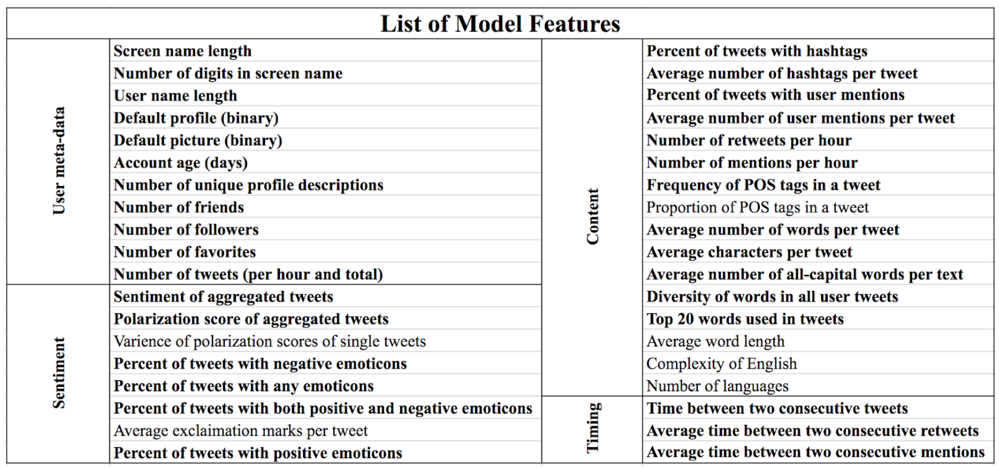

## Contents
{:.no_toc}
*  
{: toc}

## Dataset descriptions

We constructed our dataset by combining bots and human users information from two datasets. One is the relatively new Cresci-2017 dataset, with 3474 human users and 7543 bots. Another is social honeypot dataset, containing 22,223 bots and 19,276 human users. Below is a detailed description of two datasets.

### 1. cresci-2017 dataset

Cresci-2017 dataset is consisted of (i) genuine, (ii) traditional, and (iii) social spambot Twitter accounts, annotated by CrowdFlower contributors.[1]

The genuine accounts dataset is a random sample of genuine (human-operated) accounts. They randomly contacted Twitter users by asking a simple question in natural language. All the replies to the questions were manually verified and all the 3,474 accounts that answered were certified as humans.

The traditional spambot dataset is composed of simplistic bots that repeatedly mention other users in tweets containing scam URLs or repeatedly tweet about open job positions and job offers.

The social spambot dataset is composed of bots identified during Mayoral election in Rome in 2014, bots which spent several months promoting the #TALNTS hashtag and bots which advertise products on sale on Amazon.com.


```python
# Genuine users
gu_df = pd.read_csv('./cresci-2017.csv/datasets_full.csv/genuine_accounts.csv/users.csv', sep = ',')
gu_list = gu_df['id'].values.astype(int)

# Social spambots
ssbots1_df = pd.read_csv('./cresci-2017.csv/datasets_full.csv/social_spambots_1.csv/users.csv', sep = ',')
ssbots1_list = ssbots1_df['id'].values.astype(int)
ssbots2_df = pd.read_csv('./cresci-2017.csv/datasets_full.csv/social_spambots_2.csv/users.csv', sep = ',')
ssbots2_list = ssbots2_df['id'].values.astype(int)
ssbots3_df = pd.read_csv('./cresci-2017.csv/datasets_full.csv/social_spambots_3.csv/users.csv', sep = ',')
ssbots3_list = ssbots3_df['id'].values.astype(int)

# traditional spambots
tsbots1_df = pd.read_csv('./cresci-2017.csv/datasets_full.csv/traditional_spambots_1.csv/users.csv', sep = ',')
tsbots1_list = tsbots1_df['id'].values.astype(int)
tsbots2_df = pd.read_csv('./cresci-2017.csv/datasets_full.csv/traditional_spambots_2.csv/users.csv', sep = ',')
tsbots2_list = tsbots2_df['id'].values.astype(int)
tsbots3_df = pd.read_csv('./cresci-2017.csv/datasets_full.csv/traditional_spambots_3.csv/users.csv', sep = ',')
tsbots3_list = tsbots3_df['id'].values.astype(int)
tsbots4_df = pd.read_csv('./cresci-2017.csv/datasets_full.csv/traditional_spambots_4.csv/users.csv', sep = ',')
tsbots4_list = tsbots4_df['id'].values.astype(int)

# combine social spambots and traditional spambots
ssbots_list = list(ssbots1_list) + list(ssbots2_list) + list(ssbots3_list)
tsbots_list = list(tsbots1_list) + list(tsbots2_list) + list(tsbots3_list) + list(tsbots4_list)
```

### 2. Social Honeypot Dataset

Social Honeypot Dataset was first constructed in Lee et al.[2]. The authors identified bot users by posting random messages and engaging with 60 social honeypot accounts on Twitter. Once an account is lured and connected to the social honeypot account, the Observation system will get their information and keep track of their behaviors. By using Expectation Maximization algorithm, the content polluters are classified into four groups, including duplicate spammers, duplicate @ spammers, malicious promoters and friend infiltrators. In total, this dataset consists of 22,223 bots and 19,276 legitimate users. 


```python
# Legitimate user info
lu_df = pd.read_csv('./social_honeypot_icwsm_2011/legitimate_users.txt', sep = '\t', header = None)
lu_df.columns = ['UserID', 'CreatedAt', 'CollectedAt', 'NumerOfFollowings', 'NumberOfFollowers', 'NumberOfTweets', 'LengthOfScreenName', 'LengthOfDescriptionInUserProfile']
lu_tweets_df = pd.read_csv('./social_honeypot_icwsm_2011/legitimate_users_tweets.txt', sep = '\t', header = None)
lu_tweets_df.columns = ['UserID', 'TweetID', 'Tweet', 'CreatedAt']
lu_follow_df = pd.read_csv('./social_honeypot_icwsm_2011/legitimate_users_followings.txt', sep = '\t', header = None)
lu_follow_df.columns = ['UserID', 'SeriesOfNumberOfFollowings']

# Content polluters info
bots_df = pd.read_csv('./social_honeypot_icwsm_2011/content_polluters.txt', sep = '\t', header = None)
bots_df.columns = ['UserID', 'CreatedAt', 'CollectedAt', 'NumerOfFollowings', 'NumberOfFollowers', 'NumberOfTweets', 'LengthOfScreenName', 'LengthOfDescriptionInUserProfile']
bots_tweets_df = pd.read_csv('./social_honeypot_icwsm_2011/content_polluters_tweets.txt', sep = '\t', header = None)
bots_tweets_df.columns = ['UserID', 'TweetID', 'Tweet', 'CreatedAt']
bots_follow_df = pd.read_csv('./social_honeypot_icwsm_2011/content_polluters_followings.txt', sep = '\t', header = None)
bots_follow_df.columns = ['UserID', 'SeriesOfNumberOfFollowings']

# Construct user id lists
lu_list = lu_df['UserID'].values.astype(int)
bot_list = bots_df['UserID'].values.astype(int)
```


## Scrape data from Tweepy API

To access the data, we used tweepy, an open-source library which provides access to the Twitter API for Python. Tweepy accesses Twitter via OAuth, requiring creation of a Twitter Developer Account and the generation of consumer keys and access tokens on Twitter developer platform. 

### 1. Twitter API Login

The first thing that is needed is to gain access to the Twitter API, this involves setting up an account on the Twitter Development Platform, located here. Once this is done, we have access to our access token and consumer key which allows us to connect to the API.

```python
# Log in to Twitter API
auth = tweepy.OAuthHandler('consumer_key', 'consumer_secret')
auth.set_access_token('access_token', 'access_token_secret')
api = tweepy.API(auth)
```


### 2. Scrape the data through Tweepy API

```python
# Given a name list and number of tweets needed to extract for each account
# Return a dictionary of dataframes
# Each dataframe contains info of one user
def API_scrap(name_list, count_num):
    fail_lst = []
    user_dfs = {}
    for name in name_list:
        try:
            status_a = api.user_timeline(name, count = count_num, tweet_mode = 'extended')
            user_dfs[name] = pd.DataFrame()
            for i in range(len(status_a)):
                json_str = json.dumps(status_a[i]._json)
                jdata = json_normalize(json.loads(json_str))
                user_dfs[name] = user_dfs[name].append(jdata, ignore_index=True)

        except:
            fail_lst.append(name)
            continue
    
    return user_dfs, fail_lst

gu_dfs, fail_lst = API_scrap(gu_list, 10)
ssbots_dfs, ssbots_fail_lst = API_scrap(ssbots_list, 10)
tsbots_dfs, tsbots_fail_lst = API_scrap(tsbots_list, 10)
sh_user_dfs, sh_fail_lst = API_scrap(lu_list, 10)
sh_bot_dfs, sh_bot_fail_lst = API_scrap(bot_list, 10)
```

## Feature Engineering

In this section we explore the idea of generating further variables from already available information. The aim of the feature engineering section is to expand our number of features until we have all of the features outlined in the table below. Most of these features were suggested by journal articles found during the literature review.

{: .center}

### 1. User Meta-data Features

From the scraped data we got from Twitter API, the returned user object contains a lot of useful informations that could be related to bot detection. Among those user-related features we extracted, there are three groups of them that could potentially differ between bots and human users.

First, bots love anonymity. There are several features related to the account settings which bots won't bother to change. Also instead of creating an attractive and meaningful screen name/user name, bots tend to use some lengthy, random names. To capture this behavior, we extracted features including default profile, default pictures and number of unique profile descriptions, screen name length, user name length, number of digits in screen name. 

Second, bots post a lot but don't have a strong preference on other people's opinions. Bots are tireless and active all the time, busy retweeting . This is why the number of tweets(per hour and total), time between each tweet and number of favorites are interesting features to look at. 

Third, bots are unwelcomed naughty "kids". Bot accounts tend to recently created, with a few friends, since they don't interact with other users that often. But it might have a large number of followers due to their activity. Considering this, we included featurs like the account age, number of followers and number of friends.


```python
# User ID
def user_id(df):
    try:
        return df['user.id_str'][0]
    except:
        return None
    
# Screen name length
def sname_len(df):
    try:
        return len(df['user.screen_name'][0])
    except:
        return None

# Number of digits in screen name
def sname_digits(df):
    try:
        return sum(c.isdigit() for c in df['user.screen_name'][0])
    except:
        return None
    
# User name length
def name_len(df):
    try: 
        return len(df['user.name'][0])
    except:
        return None

# Default profile
def def_profile(df):
    try:
        return int(df['user.default_profile'][0]*1)
    except:
        return None

# Default picture
def def_picture(df):
    try:
        return int(df['user.default_profile_image'][0]*1)
    except:
        return None

# Account age (in days)
def acc_age(df):
    try:
        d0 = datetime.strptime(df['user.created_at'][0],'%a %b %d %H:%M:%S %z %Y')
        d1 = datetime.now(timezone.utc)
        return (d1-d0).days
    except:
        return None

# Number of unique profile descriptions
def num_descrip(df):
    try:
        string = df['user.description'][0]
        return len(re.sub(r'\s', '', string).split(','))
    except:
        return None

# Number of friends
def friends(df):
    try:
        return df['user.friends_count'][0]
    except: 
        return None

# Number of followers
def followers(df):
    try:
        return df['user.followers_count'][0]
    except: 
        return None

# Number of favorites
def favorites(df):
    try:
        return df['user.favourites_count'][0]
    except:
        return None

# Number of tweets (including retweets, per hour and total)
def num_tweets(df):
    try:
        total = df['user.statuses_count'][0]
        per_hour = total/(acc_age(df)*24)
        return total, per_hour
    except:
        return None, None

def tweets_time(df):
    try:
        time_lst = []
        for i in range(len(df)-1):
            if df['retweeted'][i] == False:
                time_lst.append(df['created_at'][i])

        interval_lst = []
        for j in range(len(time_lst)-1):
            d1 = datetime.strptime(df['created_at'][j],'%a %b %d %H:%M:%S %z %Y')
            d2 = datetime.strptime(df['created_at'][j+1],'%a %b %d %H:%M:%S %z %Y')
            interval_lst.append((d2-d1).seconds)

        return np.array(interval_lst)
    except:
        return None
```


```python
# Given a dictionary of dataframes with one dataframe for each user
# this function processes the data and extracted all the user-related features
# and saves it to a dataframe with one row for each user

def create_df(user_dfs, filename):
    columns_lst = ['User ID', 'Screen name length', 'Number of digits in screen name', 'User name length', 'Default profile (binary)','Default picture (binary)','Account age (days)', 'Number of unique profile descriptions','Number of friends','Number of followers','Number of favorites','Number of tweets per hour', 'Number of tweets total','timing_tweet']

    # Create user dataframe
    user_full_df = pd.DataFrame(columns = columns_lst)
    count = 0
    for name in user_dfs.keys():
        df = user_dfs[name]
        tweets_total, tweets_per_hour = num_tweets(df)
        data = [user_id(df), sname_len(df), sname_digits(df), name_len(df), def_profile(df), def_picture(df), acc_age(df), num_descrip(df), friends(df), followers(df), favorites(df), tweets_per_hour, tweets_total, np.mean(tweets_time(df))]
        user_full_df.loc[count] = data
        count += 1

    user_full_df = user_full_df.dropna()
    user_full_df.to_csv(filename+'.csv', encoding='utf-8', index=False)
    return user_full_df

gu_full_df = create_df(gu_dfs, 'gu_dataframe')
ssbots_full_df = create_df(ssbots_dfs, 'ssbots_dataframe')
tsbots_full_df = create_df(tsbots_dfs, 'tsbots_dataframe')
combined_bot_df = pd.concat([ssbots_full_df, tsbots_full_df], axis=0, sort=False)
sh_user_full_df = create_df(sh_user_dfs, 'sh_user_dataframe')
sh_bots_full_df = create_df(sh_bot_dfs, 'sh_bot_dataframe')
```

Now we can take a look at our final dataset and make sure everything has worked and saved correctly.

```python
bot_df_final = pd.read_csv('bot_df_final.csv')
bot_df_final.head()
```

<div>
<style scoped>
    .dataframe tbody tr th:only-of-type {
        vertical-align: middle;
    }

    .dataframe tbody tr th {
        vertical-align: top;
    }

    .dataframe thead th {
        text-align: right;
    }
</style>
<table border="1" class="dataframe">
  <thead>
    <tr style="text-align: right;">
      <th></th>
      <th>User ID</th>
      <th>Screen name length</th>
      <th>Number of digits in screen name</th>
      <th>User name length</th>
      <th>Default profile (binary)</th>
      <th>Default picture (binary)</th>
      <th>Account age (days)</th>
      <th>Number of unique profile descriptions</th>
      <th>Number of friends</th>
      <th>Number of followers</th>
      <th>Number of favorites</th>
      <th>Number of tweets per hour</th>
      <th>Number of tweets total</th>
      <th>timing_tweet</th>
    </tr>
  </thead>
  <tbody>
    <tr>
      <th>0</th>
      <td>24858289</td>
      <td>9</td>
      <td>2</td>
      <td>6</td>
      <td>1</td>
      <td>0</td>
      <td>3550</td>
      <td>1</td>
      <td>58</td>
      <td>34</td>
      <td>23</td>
      <td>0.173451</td>
      <td>14778</td>
      <td>80373.750</td>
    </tr>
    <tr>
      <th>1</th>
      <td>33212890</td>
      <td>12</td>
      <td>0</td>
      <td>14</td>
      <td>0</td>
      <td>0</td>
      <td>3517</td>
      <td>5</td>
      <td>4306</td>
      <td>34535</td>
      <td>56190</td>
      <td>0.417259</td>
      <td>35220</td>
      <td>72457.875</td>
    </tr>
    <tr>
      <th>2</th>
      <td>39773427</td>
      <td>10</td>
      <td>2</td>
      <td>15</td>
      <td>0</td>
      <td>0</td>
      <td>3493</td>
      <td>1</td>
      <td>723</td>
      <td>527</td>
      <td>50</td>
      <td>0.307365</td>
      <td>25767</td>
      <td>71798.125</td>
    </tr>
    <tr>
      <th>3</th>
      <td>57007623</td>
      <td>14</td>
      <td>0</td>
      <td>18</td>
      <td>0</td>
      <td>0</td>
      <td>3430</td>
      <td>1</td>
      <td>401</td>
      <td>464</td>
      <td>38</td>
      <td>0.103790</td>
      <td>8544</td>
      <td>60956.875</td>
    </tr>
    <tr>
      <th>4</th>
      <td>96435556</td>
      <td>10</td>
      <td>0</td>
      <td>7</td>
      <td>0</td>
      <td>0</td>
      <td>3279</td>
      <td>1</td>
      <td>673</td>
      <td>387</td>
      <td>1773</td>
      <td>0.679793</td>
      <td>53497</td>
      <td>84675.750</td>
    </tr>
  </tbody>
</table>
</div>


## Natural Language Processing and Text-Based Features

### Background and feature description

As we learned in our literature review, user-based features provide sufficient information to identify bots. However, the type of tweet and tweet content can provide additional information to help identify bots. After the list of user-based features was produced, we used the usernames to download additional information from Twitter. We downloaded the previous tweets for every user, up to 200 tweets, their timestamp, and a list of all the user mentions for each tweet. Retweets can be identified by the string 'RT' at the beginning of a tweet. Mentions can be identified by a '@' or by examining the length of the user_mentions field. We used these data to build the following features:

    FEATURE                  DESCRIPTION
    ========                 ============
    overall_sentiment :      Sentiment is a measure of the negativity or positivity of a list of words. 
                             We use the nltk and wordblob packages to evaluate the full text of a 
                             user's tweets. The full text was made of a concatination of all text tweet 
                             strings, with stopwords removed. The more positive the tweet, the higher 
                             the value for overall_sentiment, and visa versa. Scores range from -1 to 1.
                             
    overall_polarity  :      Polarity is a measure of the subjectivity of a list of words. Overall 
                             polarity is a measure of the overall subjectiveness of the user's Tweet text.
                             
    var_sentiment     :      Measure of the variance of sentiment. This is calculated by finding the 
                             variance of sentiment scores for a user across their individual Tweets.
                             
    var_polarity      :      Measure of the variance of polarity. This is calculated by finding the 
                             variance of polarity scores for a user across their individual Tweets.
                             
    percent_with_emoji:      Emojis are extracted, and the percent of tweets with at least one emoji 
                             is calculated.
                             
    percent_with_hashtag:    Percents of tweets that have at least one hashtag. 
    
    avg_num_hashtag   :      Average number of hashtags in each tweet. 
    
    percent_mention   :      Percent of tweets with at least one mention. A mention is when a user 
                             tags another user in their tweet, like @theRealDonaldTrump, etc. 
                             
    percent_retweet   :      Percent of tweets that are retweets.
    
    avg_num_mention   :      Average number of mentions in a tweet.
    
    avg_time_
    between_mention   :      Average time between tweets that have at least one mention. If a user 
                             has no mentions or only one mention, the mean is imputed.
                             
    avg_time_
    between_retweet   :      Average time between retweets. If a user has no retweets or only one 
                             retweet, the mean is imputed.
                             
    avg_word_len      :      The average word length in the full tweet text.
    
    avg_num_exclamation:     Average number of ! characters in the full tweet text.
    
    avg_num_ellipses  :      Average number of ... characters in the full tweet text.
    
    avg_num_caps      :      Average number of words with capital letters in full tweet text.
    
    avg_words_per_tweet:     Average number of words per tweet.
    
    word_diversity    :      The word diversity is a measure of number of unique words/number 
                             of total words. This is calculated on the full tweet text.
                             
    difficult_
    word_score        :      This is calculated using the textstat package, and returns 
                             the number of difficult words/total number of words for the full tweet text.
                             
    num_languages     :      The language for each tweet is determined, and num_languages is the 
                             sum of unique tweet languages.
                             
    overall_language  :      The language of the full tweet text.
    
    avg_readability_DC:      A measure of the average Dale Chall readability score. This 
                             returns the average grade level necessary to read and comprehend the text.  
                             
    avg_flesch_
    reading_ease      :      Flesch reading ease measures the readability of text. A higher score is better.
    
    avg_readability_
    combined_metric :        Measure for the overall readability that combines a wide variety of 
                             reading metrics, including the aformentioned Flesch reading metric and 
                             Dale Chall readability score. 

### Description of data aquisition, cleaning, and feature construction

#### 1) Import the relevant packages 


```python
from os import listdir
from os.path import isfile, join
import sys
import jsonpickle
import os
import tweepy
import nltk 
import pandas as pd
import json
import csv
from pandas.io.json import json_normalize
from datetime import datetime, timezone
from nltk.corpus import stopwords
from string import punctuation
from bs4 import BeautifulSoup
import numpy as np
import botometer
import re
import seaborn as sns
import matplotlib.pyplot as plt
import plotly
import langdetect
import textstat
import emoji

import warnings
warnings.filterwarnings("ignore")
```

#### 2) Access the Twitter API


```python
#OAuth process, using the keys and tokens
auth = tweepy.OAuthHandler(consumer_key, consumer_secret)
auth.set_access_token(access_token, access_token_secret)
api = tweepy.API(auth)
```

#### 3) Load dataframes from 
    a) legitimate users
    b) bot users
    c) detection dataset
as generated above in user-based features. Display the head of the dataframe to check for completeness.


```python
# Read in dataset from user-features to get user-IDs

# Legitimate user info
lu_df = pd.read_csv('data_NLP/user_df_final.csv', sep = ',', header = 0)
display(lu_df.head())

# bot user info
bots_df = pd.read_csv('data_NLP/bot_df_final.csv', sep = ',', header = 0)
display(bots_df.head())

# detection data
detection_df = pd.read_csv('data_NLP/pred_dataframe.csv', sep = ',', header = 0)
display(detection_df.head())
```


<div>
<style scoped>
    .dataframe tbody tr th:only-of-type {
        vertical-align: middle;
    }

    .dataframe tbody tr th {
        vertical-align: top;
    }

    .dataframe thead th {
        text-align: right;
    }
</style>
<table border="1" class="dataframe">
  <thead>
    <tr style="text-align: right;">
      <th></th>
      <th>User ID</th>
      <th>Screen name length</th>
      <th>Number of digits in screen name</th>
      <th>User name length</th>
      <th>Default profile (binary)</th>
      <th>Default picture (binary)</th>
      <th>Account age (days)</th>
      <th>Number of unique profile descriptions</th>
      <th>Number of friends</th>
      <th>Number of followers</th>
      <th>Number of favorites</th>
      <th>Number of tweets per hour</th>
      <th>Number of tweets total</th>
      <th>timing_tweet</th>
    </tr>
  </thead>
  <tbody>
    <tr>
      <th>0</th>
      <td>614</td>
      <td>10</td>
      <td>0</td>
      <td>18</td>
      <td>0</td>
      <td>0</td>
      <td>4528</td>
      <td>3</td>
      <td>2253</td>
      <td>1658</td>
      <td>5794</td>
      <td>0.141766</td>
      <td>15406</td>
      <td>69459.000</td>
    </tr>
    <tr>
      <th>1</th>
      <td>1038</td>
      <td>7</td>
      <td>0</td>
      <td>14</td>
      <td>0</td>
      <td>0</td>
      <td>4526</td>
      <td>5</td>
      <td>1042</td>
      <td>1419</td>
      <td>4721</td>
      <td>0.313614</td>
      <td>34066</td>
      <td>85022.250</td>
    </tr>
    <tr>
      <th>2</th>
      <td>1437</td>
      <td>6</td>
      <td>0</td>
      <td>10</td>
      <td>0</td>
      <td>0</td>
      <td>4525</td>
      <td>2</td>
      <td>211</td>
      <td>287</td>
      <td>408</td>
      <td>0.029448</td>
      <td>3198</td>
      <td>62822.625</td>
    </tr>
    <tr>
      <th>3</th>
      <td>2615</td>
      <td>7</td>
      <td>0</td>
      <td>11</td>
      <td>0</td>
      <td>0</td>
      <td>4522</td>
      <td>2</td>
      <td>676</td>
      <td>758</td>
      <td>85</td>
      <td>0.007159</td>
      <td>777</td>
      <td>53885.750</td>
    </tr>
    <tr>
      <th>4</th>
      <td>3148</td>
      <td>8</td>
      <td>0</td>
      <td>13</td>
      <td>0</td>
      <td>0</td>
      <td>4515</td>
      <td>3</td>
      <td>3835</td>
      <td>7941</td>
      <td>1629</td>
      <td>0.278728</td>
      <td>30203</td>
      <td>43391.625</td>
    </tr>
  </tbody>
</table>
</div>


<div>
<style scoped>
    .dataframe tbody tr th:only-of-type {
        vertical-align: middle;
    }

    .dataframe tbody tr th {
        vertical-align: top;
    }

    .dataframe thead th {
        text-align: right;
    }
</style>
<table border="1" class="dataframe">
  <thead>
    <tr style="text-align: right;">
      <th></th>
      <th>User ID</th>
      <th>Screen name length</th>
      <th>Number of digits in screen name</th>
      <th>User name length</th>
      <th>Default profile (binary)</th>
      <th>Default picture (binary)</th>
      <th>Account age (days)</th>
      <th>Number of unique profile descriptions</th>
      <th>Number of friends</th>
      <th>Number of followers</th>
      <th>Number of favorites</th>
      <th>Number of tweets per hour</th>
      <th>Number of tweets total</th>
      <th>timing_tweet</th>
    </tr>
  </thead>
  <tbody>
    <tr>
      <th>0</th>
      <td>24858289</td>
      <td>9</td>
      <td>2</td>
      <td>6</td>
      <td>1</td>
      <td>0</td>
      <td>3550</td>
      <td>1</td>
      <td>58</td>
      <td>34</td>
      <td>23</td>
      <td>0.173451</td>
      <td>14778</td>
      <td>80373.750</td>
    </tr>
    <tr>
      <th>1</th>
      <td>33212890</td>
      <td>12</td>
      <td>0</td>
      <td>14</td>
      <td>0</td>
      <td>0</td>
      <td>3517</td>
      <td>5</td>
      <td>4306</td>
      <td>34535</td>
      <td>56190</td>
      <td>0.417259</td>
      <td>35220</td>
      <td>72457.875</td>
    </tr>
    <tr>
      <th>2</th>
      <td>39773427</td>
      <td>10</td>
      <td>2</td>
      <td>15</td>
      <td>0</td>
      <td>0</td>
      <td>3493</td>
      <td>1</td>
      <td>723</td>
      <td>527</td>
      <td>50</td>
      <td>0.307365</td>
      <td>25767</td>
      <td>71798.125</td>
    </tr>
    <tr>
      <th>3</th>
      <td>57007623</td>
      <td>14</td>
      <td>0</td>
      <td>18</td>
      <td>0</td>
      <td>0</td>
      <td>3430</td>
      <td>1</td>
      <td>401</td>
      <td>464</td>
      <td>38</td>
      <td>0.103790</td>
      <td>8544</td>
      <td>60956.875</td>
    </tr>
    <tr>
      <th>4</th>
      <td>96435556</td>
      <td>10</td>
      <td>0</td>
      <td>7</td>
      <td>0</td>
      <td>0</td>
      <td>3279</td>
      <td>1</td>
      <td>673</td>
      <td>387</td>
      <td>1773</td>
      <td>0.679793</td>
      <td>53497</td>
      <td>84675.750</td>
    </tr>
  </tbody>
</table>
</div>


<div>
<style scoped>
    .dataframe tbody tr th:only-of-type {
        vertical-align: middle;
    }

    .dataframe tbody tr th {
        vertical-align: top;
    }

    .dataframe thead th {
        text-align: right;
    }
</style>
<table border="1" class="dataframe">
  <thead>
    <tr style="text-align: right;">
      <th></th>
      <th>User ID</th>
      <th>Screen name length</th>
      <th>Number of digits in screen name</th>
      <th>User name length</th>
      <th>Default profile (binary)</th>
      <th>Default picture (binary)</th>
      <th>Account age (days)</th>
      <th>Number of unique profile descriptions</th>
      <th>Number of friends</th>
      <th>Number of followers</th>
      <th>Number of favorites</th>
      <th>Number of tweets per hour</th>
      <th>Number of tweets total</th>
      <th>timing_tweet</th>
    </tr>
  </thead>
  <tbody>
    <tr>
      <th>0</th>
      <td>876476261220179968</td>
      <td>8</td>
      <td>0</td>
      <td>9</td>
      <td>1</td>
      <td>0</td>
      <td>538</td>
      <td>1</td>
      <td>591</td>
      <td>605</td>
      <td>20523</td>
      <td>0.695942</td>
      <td>8986</td>
      <td>86336.625</td>
    </tr>
    <tr>
      <th>1</th>
      <td>909863671563739136</td>
      <td>11</td>
      <td>2</td>
      <td>7</td>
      <td>1</td>
      <td>0</td>
      <td>445</td>
      <td>5</td>
      <td>437</td>
      <td>344</td>
      <td>3260</td>
      <td>0.298315</td>
      <td>3186</td>
      <td>86327.750</td>
    </tr>
    <tr>
      <th>2</th>
      <td>951973545831223296</td>
      <td>14</td>
      <td>2</td>
      <td>13</td>
      <td>1</td>
      <td>1</td>
      <td>329</td>
      <td>1</td>
      <td>61</td>
      <td>164</td>
      <td>39313</td>
      <td>5.012918</td>
      <td>39582</td>
      <td>86379.250</td>
    </tr>
    <tr>
      <th>3</th>
      <td>981943174947065856</td>
      <td>12</td>
      <td>0</td>
      <td>10</td>
      <td>0</td>
      <td>0</td>
      <td>247</td>
      <td>1</td>
      <td>1298</td>
      <td>401</td>
      <td>31724</td>
      <td>1.750675</td>
      <td>10378</td>
      <td>86203.875</td>
    </tr>
    <tr>
      <th>4</th>
      <td>4735793156</td>
      <td>10</td>
      <td>0</td>
      <td>5</td>
      <td>1</td>
      <td>0</td>
      <td>1063</td>
      <td>7</td>
      <td>160</td>
      <td>112</td>
      <td>32158</td>
      <td>0.263209</td>
      <td>6715</td>
      <td>84869.125</td>
    </tr>
  </tbody>
</table>
</div>


```python
# get list of each type of users 
lu_list = lu_df['User ID'].values.astype(int)
bot_list = bots_df['User ID'].values.astype(int)
detection_list = detection_df['User ID'].values.astype(int)
```

#### 4) Scrape the most recent tweets for each user (200 tweets maximum)


```python
# Given a name list and number of tweets needed to extract for each account
# Return a dictionary of dataframes
# Each dataframe contains info of one user
def API_scrape(name_list, count_num):
    fail_lst = []
    user_dfs = {}
    for name in name_list:
        try:
            status_a = api.user_timeline(name, count = count_num, tweet_mode = 'extended')
            user_dfs[name] = pd.DataFrame()
            for i in range(len(status_a)):
                json_str = json.dumps(status_a[i]._json)
                jdata = json_normalize(json.loads(json_str))
                user_dfs[name] = user_dfs[name].append(jdata, ignore_index=True)
        
        
            single_user = user_dfs[name][['full_text','created_at','entities.user_mentions']].copy().reset_index()
            single_user['user_id'] = name
            single_user.drop(['index'], inplace=True, axis = 1)
            filepath ='data_NLP/detection/{}_tweets.csv'.format(name)
            single_user.to_csv(filepath, sep='\t')
        
        except Exception as e:
            print(e)
            fail_lst.append(name)
            continue
    
    return user_dfs, fail_lst
```


```python
# scrape the last 200 tweets from users in above lists 
get_data = False
if get_data:
    user_dfs_legit, fail_lst_legit = API_scrape(lu_list, 200)
    user_dfs_bot, fail_lst_bot = API_scrape(bot_list, 200)
    user_dfs_detection, fail_lst_detection = API_scrape(detection_list, 200)
    
```

#### 5) Generate list of files for each type of user (bot, legitimate, detection)


```python
# Concatenate user data of each type into list 
!ls
mypath_bots = 'data_NLP/bots/'
mypath_legit = 'data_NLP/legit/'
mypath_detect = 'data_NLP/detection/'
botfiles = [f for f in listdir(mypath_bots) if isfile(join(mypath_bots, f)) and not f=='.DS_Store']
legitfiles = [f for f in listdir(mypath_legit) if isfile(join(mypath_legit, f))and not f=='.DS_Store']
detectfiles = [f for f in listdir(mypath_detect) if isfile(join(mypath_detect, f))and not f=='.DS_Store']
```


## References

**[1]** *Cresci, S., Di Pietro, R., Petrocchi, M., Spognardi, A., & Tesconi, M. (2017, April). The paradigm-shift of social spambots: Evidence, theories, and tools for the arms race. In Proceedings of the 26th International Conference on World Wide Web Companion (pp. 963-972). International World Wide Web Conferences Steering Committee.*

**[2]** *Lee, K., Eoff, B. D., & Caverlee, J. (2011, July). Seven Months with the Devils: A Long-Term Study of Content Polluters on Twitter. In ICWSM (pp. 185-192).*
