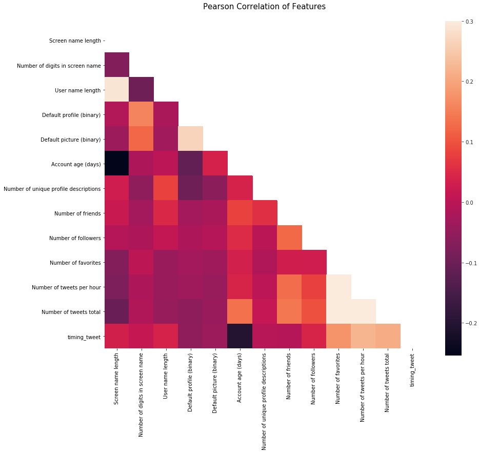

### Pearson Correlation Heatmap

Let us generate some correlation plots of the features to see how related one feature is to the next. To do so, we will utilise the Seaborn plotting package which allows us to plot heatmaps very conveniently as follows


```python
colormap = plt.cm.RdBu
plt.figure(figsize=(14,12))
plt.title('Pearson Correlation of Features', y=1.05, size=15)
# Generate a mask for the upper triangle
corr = X_train_scaled.astype(float).corr()
mask = np.zeros_like(corr, dtype=np.bool)
mask[np.triu_indices_from(mask)] = True
#mask = np.zeros_like(X_train_scaled)
#mask[np.triu_indices_from(mask)] = True
with sns.axes_style("white"):
    ax = sns.heatmap(corr, mask=mask, vmax=.3, square=True)
#sns.heatmap(X_train_scaled.astype(float).corr(),linewidths=0.1,vmax=1.0,
#            square=True, cmap=colormap, linecolor='white', annot=True)
```





One thing that that the Pearson Correlation plot can tell us is that there are not too many features strongly correlated with one another. This is good from a point of view of feeding these features into your learning model because this means that there isn't much redundant or superfluous data in our training set and we are happy that each feature carries with it some unique information. Here the most correlated features are that of `number of tweets per hour` and `number of tweets total` which are both correlated with `timing_tweet`. I'll still leave both features in because this correlation is still relatively low.

### Pairplots

Now let us generate some pairplots to observe the distribution of data from one feature to the other. Once again we use Seaborn to help us.


```python
pairplot_df = total_df.copy()
pairplot_df['Number of friends'] = np.log10(pairplot_df['Number of friends'])
pairplot_df['Number of followers'] = np.log10(pairplot_df['Number of followers'])
pairplot_df['Number of favorites'] = np.log10(pairplot_df['Number of favorites'])
pairplot_df['Number of tweets total'] = np.log10(pairplot_df['Number of tweets total'])

sns.set(style="ticks", color_codes=True)
g = sns.pairplot(pairplot_df, vars=[u'Account age (days)', 'Number of friends', u'Number of followers', u'Number of favorites', u'Number of tweets total', u'timing_tweet'],
                 hue='bot', palette = 'seismic',diag_kind = 'kde',diag_kws=dict(shade=True),plot_kws=dict(s=10))
#g.set(xticklabels=[])
```


