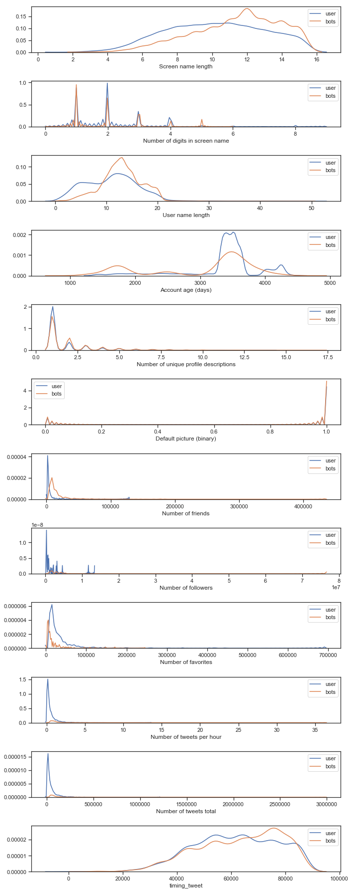
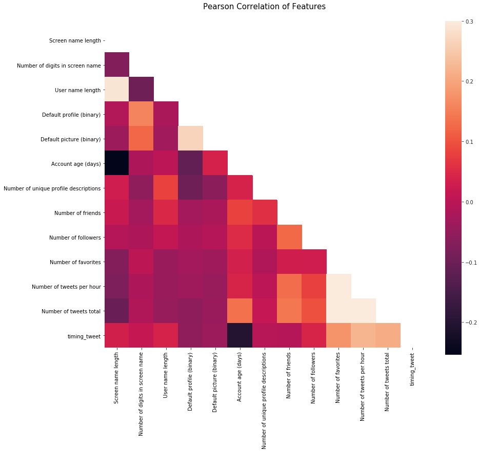
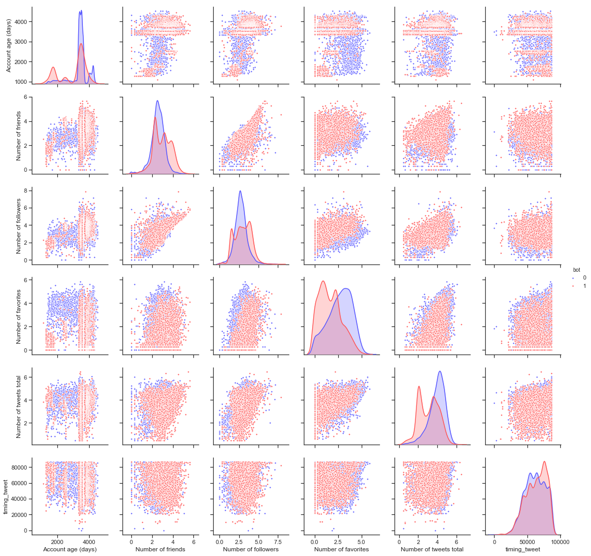

## Contents
{:.no_toc}
*  
{: toc}

## Generate Training and Test 

Before we look at the data we first generate a training and test set which will be used later for model evaluation. The data is normalized such that it is easier to compare feature variables and because some of the models require normalized data, especially when regularization is used.

```python
bot_df = pd.read_csv(r"bot_df_final.csv",index_col='User ID')
user_df = pd.read_csv(r"user_df_final.csv",index_col='User ID')

bot_df['bot']=1
user_df['bot']=0

total_df = bot_df.append(user_df)

train_data, test_data = train_test_split(total_df, test_size = 0.3, random_state=99)

Y_train=train_data['bot']
Y_test=test_data['bot']
X_train=train_data.drop('bot',axis=1)
X_test=test_data.drop('bot',axis=1)

def normalize(df,df_train):
    result = df.copy()
    for feature_name in df_train.columns:
        max_value = df_train[feature_name].max()
        min_value = df_train[feature_name].min()
        result[feature_name] = (df[feature_name] - min_value) / (max_value - min_value)
    return result

X_train_scaled=normalize(X_train,X_train)
X_test_scaled=normalize(X_test,X_train)
```

## User Feature Statisitcs

First we compared the distributions of the user features for bots and human users. 


```python
features = ['Screen name length', 'Number of digits in screen name', 'User name length', 'Account age (days)', 'Number of unique profile descriptions','Default picture (binary)','Number of friends','Number of followers','Number of favorites','Number of tweets per hour', 'Number of tweets total','timing_tweet']
fig, axes = plt.subplots(len(features),1, figsize = (10,25))
for i in range(len(features)):
    sns.kdeplot(user_df[features[i]], ax = axes[i], label = 'user')
    sns.kdeplot(bot_df[features[i]], ax = axes[i], label = 'bots')
    axes[i].set_xlabel(features[i])
    axes[i].legend()

plt.tight_layout()
plt.show()
```




Although we expected some features to differ, some of the actual distributions might not be easily distinguished between bots and human users, such as number of digits in the screen name and number of unique descriptions. Some of them are easier to differentiate, such as number of friends, number of followers, number of favorites and number of tweets, indicating that those features might play an important role in the bot detection.

### Pearson Correlation Heatmap

Correlation plots of the features tell us how related one feature is to the next. We would like there to be little correlation between features such that all the features are informative, meaning there are no redundant features being used in our predictions.

```python
colormap = plt.cm.RdBu
plt.figure(figsize=(14,12))
plt.title('Pearson Correlation of Features', y=1.05, size=15)

# Generate a mask for the upper triangle
corr = X_train_scaled.astype(float).corr()
mask = np.zeros_like(corr, dtype=np.bool)
mask[np.triu_indices_from(mask)] = True
with sns.axes_style("white"):
    ax = sns.heatmap(corr, mask=mask, vmax=.3, square=True)
```



The correlation plot tells us that most of the features are not correlated, which is what we like to see. There are a couple of features that have a correlation of approximately 0.3, this is higher than the rest of the features but is still relatively low and should not cause any issues. Thus, we can leave all of these features in our dataset.

### Pairplot

A pairplot allows us to get a visual plot of the relationship between different feature variables. We can also color code the plot to show which of the particular users are bots and which are not, so that we can visually see the boundaries between users and bots to aid us in the model development and feature engineering processes.

```python
pairplot_df = total_df.copy()
pairplot_df['Number of friends'] = np.log10(pairplot_df['Number of friends'])
pairplot_df['Number of followers'] = np.log10(pairplot_df['Number of followers'])
pairplot_df['Number of favorites'] = np.log10(pairplot_df['Number of favorites'])
pairplot_df['Number of tweets total'] = np.log10(pairplot_df['Number of tweets total'])

sns.set(style="ticks", color_codes=True)
g = sns.pairplot(pairplot_df, vars=[u'Account age (days)', 'Number of friends', u'Number of followers', u'Number of favorites', u'Number of tweets total', u'timing_tweet'],
                 hue='bot', palette = 'seismic',diag_kind = 'kde',diag_kws=dict(shade=True),plot_kws=dict(s=10))
#g.set(xticklabels=[])
```




We see from the pairplot that there are several features where there is a relatively clear boundary between bots and users, indicating that we should be able to obtain good predictions from our models when utilizing these features. However, none of these features are able to completely separate bots from legitimate users, and hence using many features will get us better predictions. 


