## Contents
{:.no_toc}
*  
{: toc}

### Important packages

1. `Tweepy` - **Twitter API** - [Documentation](http://docs.tweepy.org/en/v3.5.0/api.html#tweepy-api-twitter-api-wrapper)

2. `nltk` - **Natural language processing library** - [Documentation](http://www.nltk.org/howto/twitter.html)

3. `jsonpickle` - **Converts Python objects into JSON** - [Documentation](https://jsonpickle.github.io/)

4. `Pandas` - **Python Data Analysis Library** - [Documentation](https://pandas.pydata.org/)

5. `Matplotlib` - **Python data visualization library** - [Documentation](https://matplotlib.org/contents.html)

6. `Botometer` - **Bot checking library for Twitter** - [Documentation](https://market.mashape.com/OSoMe/botometer)

7. `Seaborn` - **Python data visualization library based on matplotlib** - [Documentation](https://seaborn.pydata.org/)

8. `scikit-learn` - **Python machine learning library** - [Documentation](https://scikit-learn.org/stable/documentation.html)

## Models

In this section we will go through each of the individual models worked through in the `Final_Models.ipynb` Jupyter notebook, assessing their performance on the training and test set, as well as the most important features for each model. The same 10 features were used for all models, which were taken from our dataframe that had been normalized such that regularization could be implemented, and all models with relevant hyperparameters had these tuned to attain the best accuracy achievable given the data and the assumptions of the model. The models discussed in this section are:

- Logistic Regression
- LDA/QDA
- Random Forest
- Boosting
- K Nearest Neighbors
- Feed Forward Artificial Neural Network
- Support Vector Machines
- Stacking (Meta Ensembling)
- Blended Ensemble

The overall results from these model and comparison between models is tackled in the discussion section. The overall aim for our models in this section is to obtain a high accuracy on the testing set whilst also minimizing the number of false positives, which would indicate that a human user is a bot. Minimizing false positives means that legitimate users are not unnecessary penalized if action is taken against bots in order to ameliorate the proliferance of bots on the social media platform.


## Logistic Regression

Two individual models were developed for logistic regression, first a linear logistic regression which only made use of the original 10 features from our dataframe. The second model added polynomial features of second order as well as interaction variables, which was applied using a data pipeline.

```python
logreg = LogisticRegression(C=100000,fit_intercept=True).fit(X_train_scaled,Y_train)
logreg_train = logreg.score(X_train_scaled, Y_train)
#accuracy_score(Y_train,logreg.predict(X_train_scaled), normalize=True)
print('Accuracy of logistic regression model on training set is {:.3f}'.format(logreg_train))
# Classification error on test set
#logreg_test = accuracy_score(logreg.predict(X_test_scaled), Y_test, normalize=True)
logreg_test = logreg.score(X_test_scaled, Y_test)
print('Accuracy of logistic regression model on the test set is {:.3f}'.format(logreg_test))
```

    Accuracy of logistic regression model on training set is: 0.776
    Accuracy of logistic regression model on the test set is: 0.775
    
As we can see for the basic logistic regression model, the model performs reasonably well on the dataset and is not overfitting. A confusion matrix will help us to assess the relative proportions of true positives and negatives and false positives and negatives when using this model.


```python
y_pred_logreg= logreg.predict(X_test_scaled)
df_confusion=pd.DataFrame(confusion_matrix(Y_test,y_pred_logreg))

df_conf_norm = df_confusion / df_confusion.sum(axis=1)
df_confusion.index.name='Actual'
df_confusion.columns.name='Predicted'

def plot_confusion_matrix(df_confusion, title='Confusion matrix from logreg', cmap=plt.cm.gray_r):
    plt.matshow(df_confusion) # imshow
    plt.title(title)
    plt.colorbar()
    tick_marks = np.arange(len(df_confusion.columns))
    plt.xticks(tick_marks, df_confusion.columns)
    plt.yticks(tick_marks, df_confusion.index)
    plt.ylabel(df_confusion.index.name)
    plt.xlabel(df_confusion.columns.name)

plot_confusion_matrix(df_conf_norm)
```

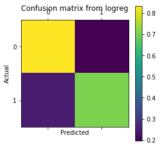

The confusion matrix for the basic logistic regression model shows us how well our model is performing in terms of testing accuracy as well as false positive rate. We see that our testing accuracy is around 80% and our false positive rating is between 0.2 and 0.3. Research papers estimate that around 10% of Twitter users are bots, which means that our model is not great as we are falsely predicting around 20% of the overall population. We should aim to reduce our false positive rate to below 10% to account for this.

So we can probably do better than the basic logistic regression model, let us first try by adding polynomial and interaction features and also cross-validation.


```python
# Logistic regression w/ quadratic + interaction terms + regularization
polynomial_logreg_estimator = make_pipeline(
    PolynomialFeatures(degree=2, include_bias=True),
    LogisticRegressionCV(multi_class="ovr", penalty='l2', cv=5, max_iter=10000))
linearLogCVpoly = polynomial_logreg_estimator.fit(X_train_scaled, Y_train)
# Compare results
print('Polynomial-logistic accuracy: train={:.1%}, test={:.1%}'.format(
    linearLogCVpoly.score(X_train_scaled, Y_train), linearLogCVpoly.score(X_test_scaled, Y_test)))
linearLogCVpoly_train = linearLogCVpoly.score(X_train_scaled, Y_train)
linearLogCVpoly_test = linearLogCVpoly.score(X_test_scaled, Y_test)
```

    Polynomial-logistic accuracy: train=80.9%, test=80.0%
    
The accuracy of the polynomial model on the test set has been improved by several percent. We should once again check the confusion matrix and see if our false positive rating has also improved.


```python
y_pred_PolyL = linearLogCVpoly.predict(X_test_scaled)

df_confusion=pd.DataFrame(confusion_matrix(Y_test,y_pred_PolyL))

df_conf_norm = df_confusion / df_confusion.sum(axis=1)
df_confusion.index.name='Actual'
df_confusion.columns.name='Predicted'

def plot_confusion_matrix(df_confusion, title='Confusion matrix from Poly-logistic', cmap=plt.cm.gray_r):
    plt.matshow(df_confusion) # imshow
    plt.title(title)
    plt.colorbar()
    tick_marks = np.arange(len(df_confusion.columns))
    plt.xticks(tick_marks, df_confusion.columns)
    plt.yticks(tick_marks, df_confusion.index)
    plt.ylabel(df_confusion.index.name)
    plt.xlabel(df_confusion.columns.name)

plot_confusion_matrix(df_conf_norm)
```

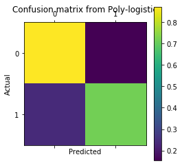

Our confusion matrix gives approximately the same value as before. The logistic regression model does a pretty good job of separating bots from legimitate users with these features. However, it performs poorly in terms of predicting a large number of false positives. Let us leave logistic regression and move on to discriminant analysis.

## LDA and QDA Model

In this section we run LDA and QDA models to classify the users into either bots or legitimate users.

```python
lda = LinearDiscriminantAnalysis(store_covariance=True)
qda = QuadraticDiscriminantAnalysis(store_covariance=True)
lda.fit(X_train_scaled, Y_train)
qda.fit(X_train_scaled, Y_train)
lda.predict(X_test_scaled)
qda.predict(X_test_scaled)

print('LDA accuracy train={:.1%}, test: {:.1%}'.format(
    lda.score(X_train_scaled, Y_train), lda.score(X_test_scaled, Y_test)))

lda_train = lda.score(X_train_scaled, Y_train)
lda_test = lda.score(X_test_scaled, Y_test)

print('QDA accuracy train={:.1%}, test: {:.1%}'.format(
    qda.score(X_train_scaled, Y_train), qda.score(X_test_scaled, Y_test)))

qda_train = qda.score(X_train_scaled, Y_train)
qda_test = qda.score(X_test_scaled, Y_test)
```

    LDA accuracy train=70.6%, test: 70.8%
    QDA accuracy train=70.8%, test: 71.1%
    
The LDA and QDA models run very quickly, which is one of their main advantages. However, as we see here, their performance on the test set is relatively poor in comparison to the logistic regression models. We see that LDA and QDA yield approximately the same values on the training and test set, which indicates that the assumption that the features are normally distributed is a reasonable assumption. Let us check the confusion matrix once again.

```python
y_pred_lda = lda.predict(X_test_scaled)

df_confusion=pd.DataFrame(confusion_matrix(Y_test,y_pred_lda))

df_conf_norm = df_confusion / df_confusion.sum(axis=1)
df_confusion.index.name='Actual'
df_confusion.columns.name='Predicted'

def plot_confusion_matrix(df_confusion, title='Confusion matrix from LDA', cmap=plt.cm.gray_r):
    plt.matshow(df_confusion) # imshow
    plt.title(title)
    plt.colorbar()
    tick_marks = np.arange(len(df_confusion.columns))
    plt.xticks(tick_marks, df_confusion.columns)
    plt.yticks(tick_marks, df_confusion.index)
    plt.ylabel(df_confusion.index.name)
    plt.xlabel(df_confusion.columns.name)

plot_confusion_matrix(df_conf_norm)
```

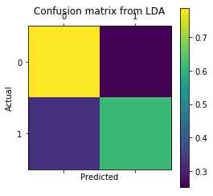

The confusion matrix for LDA shows that we are predicting a relatively low number of false positives, but we also have low values of true positives and false negatives. This is clearly not the best model to use. Let us see if QDA performs better.


```python
y_pred_qda = qda.predict(X_test_scaled)

df_confusion=pd.DataFrame(confusion_matrix(Y_test,y_pred_qda))

df_conf_norm = df_confusion / df_confusion.sum(axis=1)
df_confusion.index.name='Actual'
df_confusion.columns.name='Predicted'

def plot_confusion_matrix(df_confusion, title='Confusion matrix from QDA', cmap=plt.cm.gray_r):
    plt.matshow(df_confusion) # imshow
    plt.title(title)
    plt.colorbar()
    tick_marks = np.arange(len(df_confusion.columns))
    plt.xticks(tick_marks, df_confusion.columns)
    plt.yticks(tick_marks, df_confusion.index)
    plt.ylabel(df_confusion.index.name)
    plt.xlabel(df_confusion.columns.name)

plot_confusion_matrix(df_conf_norm)
```
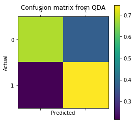

QDA has a terrible performance in terms of false positives, which are nearly 40%! Clearly discriminant analysis is not the best model to use on this particular set of data. Now we can move on and try some bagging and boosting techniques. First we will try random forest.

## Random forest

The random forest model runs a number of iterations with bootstrapped samples, and develops models where the predictors are randomly selected at each node. This helps to introduce randomness in the model which can provide variance reduction. Hopefully random forest can perform better than our previous models.

```python
rf = RandomForestClassifier(n_estimators=50 , max_depth=15, max_features='auto')
rf.fit(X_train_scaled, Y_train)
rf_train =rf.score(X_train_scaled, Y_train)
rf_test =rf.score(X_test_scaled, Y_test)

print('RF accuracy train={:.1%}, test: {:.1%}'.format(rf_train,rf_test))
y_pred = rf.predict(X_test_scaled)

df_confusion=pd.DataFrame(confusion_matrix(Y_test,y_pred  ))

df_conf_norm = df_confusion / df_confusion.sum(axis=1)
df_confusion.index.name='Actual'
df_confusion.columns.name='Predicted'
```

    RF accuracy train=99.4%, test: 91.4%
    
This is our highest test accuracy so far! This means that 9/10 of our predictions are correct, which is a big jump up from our previous models. But, we must still assess to see how high our false positive rates are using the confusion matrix. We will also check to see what the most important features are via variable importance.

```python
plt.figure(figsize=(5,5))
plt.title('Variable Importance from Random Forest')
plt.xlabel('Relative Importance')
pd.Series(rf.feature_importances_,index=list(X_train_scaled)).sort_values().plot(kind="barh")
```


    <matplotlib.axes._subplots.AxesSubplot at 0x1b41600b4e0>

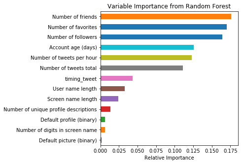

```python
def plot_confusion_matrix(df_confusion, title='Confusion matrix from RF', cmap=plt.cm.gray_r):
    plt.matshow(df_confusion) # imshow
    plt.title(title)
    plt.colorbar()
    tick_marks = np.arange(len(df_confusion.columns))
    plt.xticks(tick_marks, df_confusion.columns)
    plt.yticks(tick_marks, df_confusion.index)
    plt.ylabel(df_confusion.index.name)
    plt.xlabel(df_confusion.columns.name)

plot_confusion_matrix(df_conf_norm)
```

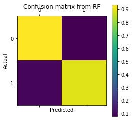

Our false positive rating for random forest is around 0.1, which is significantly better than our previous models. We are getting into the realm of acceptable accuracy with this model, but let's see if we can improve this further with a boosted model.

## AdaBoost and XGBoost

AdaBoost stands for adaptive boosting. The algorithm works by using decision tree classification, whereby the misclassified samples are used to adapt the model. This is done by successively adding models that are trained on the residuals of the misclassified samples to the original model, known as an additive model. Let's see how well AdaBoost performs.

XGBoost is a similar method to AdaBoost, and standards for extreme gradient boosting. This name comes from the optimization technique known as gradient descent that is implemented in the model. XGBoost is the most popular machine learning model utilized by Kagglers (a data science competition website) to obtain models with superior predictive capability.

```python
adaboost = AdaBoostClassifier(base_estimator=DecisionTreeClassifier(max_depth=5), n_estimators=800, learning_rate=0.01)
adaboost.fit(X_train_scaled, Y_train);
```

```python
y_pred = adaboost.predict(X_test_scaled)
pred_adaboost = [round(value) for value in y_pred]
accuracy = accuracy_score(Y_test, pred_adaboost)

adaboost_train = adaboost.score(X_train_scaled, Y_train)
adaboost_test = adaboost.score(X_test_scaled, Y_test)

print("Adaboost Test Accuracy: %.2f%%" % (accuracy * 100.0))
df_confusion=pd.DataFrame(confusion_matrix(Y_test,y_pred  ))

df_conf_norm = df_confusion / df_confusion.sum(axis=1)
df_confusion.index.name='Actual'
df_confusion.columns.name='Predicted'

def plot_confusion_matrix(df_confusion, title='Confusion matrix of adaboost', cmap=plt.cm.gray_r):
    plt.matshow(df_confusion) # imshow
    plt.title(title)
    plt.colorbar()
    tick_marks = np.arange(len(df_confusion.columns))
    plt.xticks(tick_marks, df_confusion.columns, rotation=45)
    plt.yticks(tick_marks, df_confusion.index)
    plt.ylabel(df_confusion.index.name)
    plt.xlabel(df_confusion.columns.name)

plot_confusion_matrix(df_conf_norm)

```

    Adaboost Test Accuracy: 94.58%
    
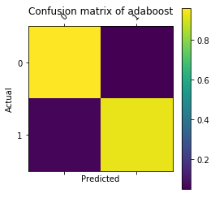

This testing accuracy is even higher than the random forest model! This is clearly our best model so far, as we are only misclassifying around 5% of the test set. We should assess the variable importance and confusion matrix as we did for the random forest model.


```python
plt.figure(figsize=(5,5))
plt.title('Variable Importance from Adaboosting')
plt.xlabel('Relative Importance')
pd.Series(adaboost.feature_importances_,index=list(X_train_scaled)).sort_values().plot(kind="barh")
```

    <matplotlib.axes._subplots.AxesSubplot at 0x1b4161a66a0>

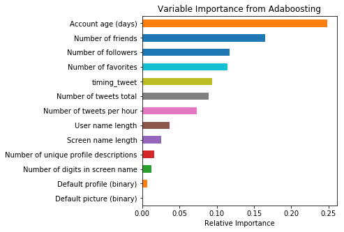


Interestingly, account age seems to be our most informative predictor, closely followed by number of friends and number of followers. The influence of account age could be because bots are more likely to be banned and thus new bots are continually created. However, we should be cautious when using this model as we are likely to overpredict that all new account are bots, which is clearly not true.

```python
import xgboost as xgb
from sklearn.metrics import confusion_matrix

xgb = xgb.XGBClassifier(max_depth=5, n_estimators=300, learning_rate=0.01).fit(X_train_scaled, Y_train)
y_pred = xgb.predict(X_test_scaled)
predictions = [round(value) for value in y_pred]
accuracy = accuracy_score(Y_test, predictions)

xgb_train = xgb.score(X_train_scaled, Y_train)
xgb_test = xgb.score(X_test_scaled, Y_test)

print("Accuracy: %.2f%%" % (accuracy * 100.0))
df_confusion=pd.DataFrame(confusion_matrix(Y_test,predictions))

df_conf_norm = df_confusion / df_confusion.sum(axis=1)
df_confusion.index.name='Actual'
df_confusion.columns.name='Predicted'

def plot_confusion_matrix(df_confusion, title='Confusion matrix of xgboost', cmap=plt.cm.gray_r):
    plt.matshow(df_confusion) # imshow
    plt.title(title)
    plt.colorbar()
    tick_marks = np.arange(len(df_confusion.columns))
    plt.xticks(tick_marks, df_confusion.columns, rotation=45)
    plt.yticks(tick_marks, df_confusion.index)
    plt.ylabel(df_confusion.index.name)
    plt.xlabel(df_confusion.columns.name)

plot_confusion_matrix(df_conf_norm)
```

    Accuracy: 92.22%
    
XGBoost also performs better than the random forest model, which is expected since we attained such a high result from our Adaboost model.

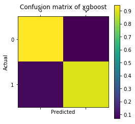

The confusion matrix for XGBoost shows that we have around 0.1 for false positives again, which is within an acceptable range. Whether this level of false positives is acceptable will be assessed in the model testing section.


```python
plt.figure(figsize=(5,5))
plt.title('Variable Importance from XGBoost')
plt.xlabel('Relative Importance')
pd.Series(xgb.feature_importances_,index=list(X_train_scaled)).sort_values().plot(kind="barh")
```

    <matplotlib.axes._subplots.AxesSubplot at 0x1b416299b70>

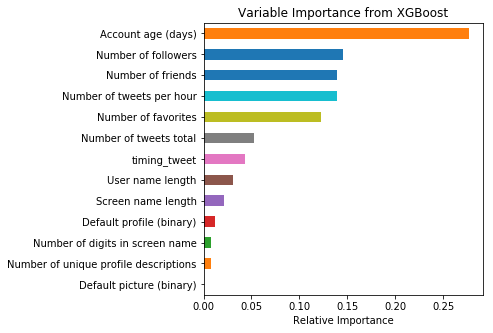


Once again, account age is by far the most important predictor for the XGBoost model.

## K Nearest Neighbors

K nearest neighbors is a non-parametric technique that looks at nearby points in order to classify a new sample. This is one of the most basic machine learning techniques but can often perform well due to its inherent lack of assumptions about the data. Let's see how well the model performs.

```python
from sklearn.neighbors import KNeighborsClassifier
from sklearn.model_selection import cross_val_score
from sklearn.model_selection import KFold

scores_mean=[]
scores_std=[]

k_number=np.arange(1,40)

for k in range(1,40):
    knn = KNeighborsClassifier(n_neighbors = k)
    score_mean= cross_val_score(knn,X_train_scaled,Y_train,cv=5).mean()
    score_std=cross_val_score(knn,X_train_scaled,Y_train,cv=5).std()
    scores_mean.append(score_mean)
```

```python
max_score_k=max(scores_mean)
best_k=scores_mean.index(max(scores_mean))+1
print('Best K=',best_k, 'with a max CV score of',max_score_k)

knn_best_k = KNeighborsClassifier(n_neighbors = best_k)
knn_best_k.fit(X_train_scaled,Y_train);

pred_best_k = knn_best_k.predict(X_test_scaled)

print('test accuracy',accuracy_score(Y_test, pred_best_k))

knn_best_k_train = knn_best_k.score(X_train_scaled, Y_train)
knn_best_k_test = knn_best_k.score(X_test_scaled, Y_test)
```

    Best K= 8 with a max CV score of 0.7114063374922827
    test accuracy 0.718296224588577
    

As should be expected from looking at the data in the EDA section, the KNN does not do as well as the other models. However, it is not the worst model we have seen and does indeed perform better than LDA and QDA.


```python
df_confusion=pd.DataFrame(confusion_matrix(Y_test,pred_best_k ))

df_conf_norm = df_confusion / df_confusion.sum(axis=1)
df_confusion.index.name='Actual'
df_confusion.columns.name='Predicted'

def plot_confusion_matrix(df_confusion, title='Confusion matrix of KNN', cmap=plt.cm.gray_r):
    plt.matshow(df_confusion) # imshow
    plt.title(title)
    plt.colorbar()
    tick_marks = np.arange(len(df_confusion.columns))
    plt.xticks(tick_marks, df_confusion.columns)
    plt.yticks(tick_marks, df_confusion.index)
    plt.ylabel(df_confusion.index.name)
    plt.xlabel(df_confusion.columns.name)

plot_confusion_matrix(df_conf_norm)
```

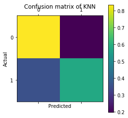

This confusion matrix tells us a similar story as our logistic regression plot.

After all of these different models, let us plot the accuracies of all of these models together and compare their performance. Further models involving stacking, blending, and K-means will be introduced in the advanced topics section and will be compared to these models.


```python
acc_scores=[accuracy_score(logreg.predict(X_test_scaled), Y_test),linearLogCVpoly.score(X_test_scaled, Y_test),lda.score(X_test_scaled, Y_test),qda.score(X_test_scaled, Y_test),accuracy_score(Y_test, pred_best_k),rf.score(X_test_scaled, Y_test),accuracy_score(Y_test, pred_adaboost),accuracy_score(Y_test, predictions)]

xx = [1,2,3,4,5,6,7,8]
index_name=['Linear Logistic','PolyLogistic', 'LDA','QDA','KNN','Random Forest','AdaBoosting','XGBoost']
plt.bar(xx, acc_scores)
plt.ylim(0.6,1)
plt.title('Accuracy score in each model ')
plt.ylabel('ACC Test')
plt.xticks(xx,index_name,rotation=90,fontsize = 14);
```

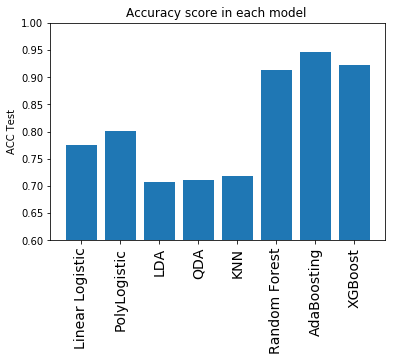


We see that our best model was AdaBoost, which achieved a 94.5% accuracy on the test set. Our worst models were KNN, LDA, and QDA. The models with the lowest level of false positives were AdaBoost, XGBoost, and random forest. These are the top three models that should be further pursued for the optimized bot detection model.


## Stacked Model

Model stacking is an efficient ensemble method in which the predictions, generated by using various machine learning algorithms, are used as inputs in a second-layer learning algorithm. This second-layer algorithm is trained to optimally combine the model predictions to form a new set of predictions. For example, when linear regression is used as second-layer modeling, it estimates these weights by minimizing the least square errors. However, the second-layer modeling is not restricted to only linear models; the relationship between the predictors can be more complex, opening the door to employing other machine learning algorithms.


Ensemble modeling and model stacking are especially popular in data science competitions, in which a sponsor posts a training set (which includes labels) and a test set (which does not include labels) and issues a global challenge to produce the best predictions of the test set for a specified performance criterion. The winning teams almost always use ensemble models instead of a single fine-tuned model. Often individual teams develop their own ensemble models in the early stages of the competition, and then join their forces in the later stages. 

Another popular data science competition is the KDD Cup. The following figure shows the winning solution for the 2015 competition, which used a three-stage stacked modeling approach. A similar approach will be trialed for this project to try and obtain maximal predictive capability.


The figure shows that a diverse set of 64 single models were used to build the model library. These models are trained by using various machine learning algorithms. For example, the green boxes represent gradient boosting models (GBM), pink boxes represent neural network models (NN), and orange boxes represent factorization machines models (FM). You can see that there are multiple gradient boosting models in the model library; they probably vary in their use of different hyperparameter settings and/or feature sets.

A simple way to enhance diversity is to train models by using different machine learning algorithms. For example, adding a factorization model to a set of tree-based models (such as random forest and gradient boosting) provides a nice diversity because a factorization model is trained very differently than decision tree models are trained. For the same machine learning algorithm, you can enhance diversity by using different hyperparameter settings and subsets of variables. If you have many features, one efficient method is to choose subsets of the variables by simple random sampling.

Overfitting is an especially big problem in model stacking, because so many predictors that all predict the same target are combined. Overfitting is partially caused by this collinearity between the predictors. The most efficient techniques for training models (especially during the stacking stages) include using cross validation and some form of regularization. A good paper that outlines this procedure is [Stacked Ensemble Models for Improved Prediction Accuracy](https://support.sas.com/resources/papers/proceedings17/SAS0437-2017.pdf).

That paper also shows how you can generate a diverse set of models by various methods (such as forests, gradient boosted decision trees, factorization machines, and logistic regression) and then combine them with stacked ensemble techniques such regularized regression methods, gradient boosting, and hill climbing methods.


Applying stacked models to real-world big data problems can produce greater prediction accuracy and robustness than do individual models. The model stacking approach is powerful and compelling enough to alter your initial data mining mindset from finding the single best model to finding a collection of really good complementary models. Of course, this method does involve additional cost both because you need to train a large number of models and because you need to use cross validation to avoid overfitting.

## Stacked Model

In this section we will try to implement a stacked model similar to that proposed in the "[Stacked Ensemble Models for Improved Prediction Accuracy](https://support.sas.com/resources/papers/proceedings17/SAS0437-2017.pdf)" paper.


```python
# Going to use these 5 base models for the stacking
from sklearn.ensemble import (RandomForestClassifier, AdaBoostClassifier, 
                              GradientBoostingClassifier, ExtraTreesClassifier)
from sklearn.svm import SVC
```


### Pearson Correlation Heatmap

Let us generate some correlation plots of the features to see how related one feature is to the next. To do so, we will utilise the Seaborn plotting package which allows us to plot heatmaps very conveniently as follows


```python
colormap = plt.cm.RdBu
plt.figure(figsize=(14,12))
plt.title('Pearson Correlation of Features', y=1.05, size=15)
# Generate a mask for the upper triangle
corr = X_train_scaled.astype(float).corr()
mask = np.zeros_like(corr, dtype=np.bool)
mask[np.triu_indices_from(mask)] = True
#mask = np.zeros_like(X_train_scaled)
#mask[np.triu_indices_from(mask)] = True
with sns.axes_style("white"):
    ax = sns.heatmap(corr, mask=mask, vmax=.3, square=True)
#sns.heatmap(X_train_scaled.astype(float).corr(),linewidths=0.1,vmax=1.0,
#            square=True, cmap=colormap, linecolor='white', annot=True)
```


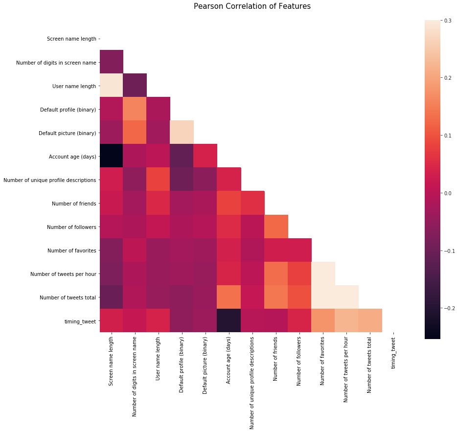


One thing that that the Pearson Correlation plot can tell us is that there are not too many features strongly correlated with one another. This is good from a point of view of feeding these features into your learning model because this means that there isn't much redundant or superfluous data in our training set and we are happy that each feature carries with it some unique information. Here the most correlated features are that of `number of tweets per hour` and `number of tweets total` which are both correlated with `timing_tweet`. I'll still leave both features in because this correlation is still relatively low.

### Pairplots

Now let us generate some pairplots to observe the distribution of data from one feature to the other. Once again we use Seaborn to help us.


```python
pairplot_df = total_df.copy()
pairplot_df['Number of friends'] = np.log10(pairplot_df['Number of friends'])
pairplot_df['Number of followers'] = np.log10(pairplot_df['Number of followers'])
pairplot_df['Number of favorites'] = np.log10(pairplot_df['Number of favorites'])
pairplot_df['Number of tweets total'] = np.log10(pairplot_df['Number of tweets total'])

sns.set(style="ticks", color_codes=True)
g = sns.pairplot(pairplot_df, vars=[u'Account age (days)', 'Number of friends', u'Number of followers', u'Number of favorites', u'Number of tweets total', u'timing_tweet'],
                 hue='bot', palette = 'seismic',diag_kind = 'kde',diag_kws=dict(shade=True),plot_kws=dict(s=10))
#g.set(xticklabels=[])
```


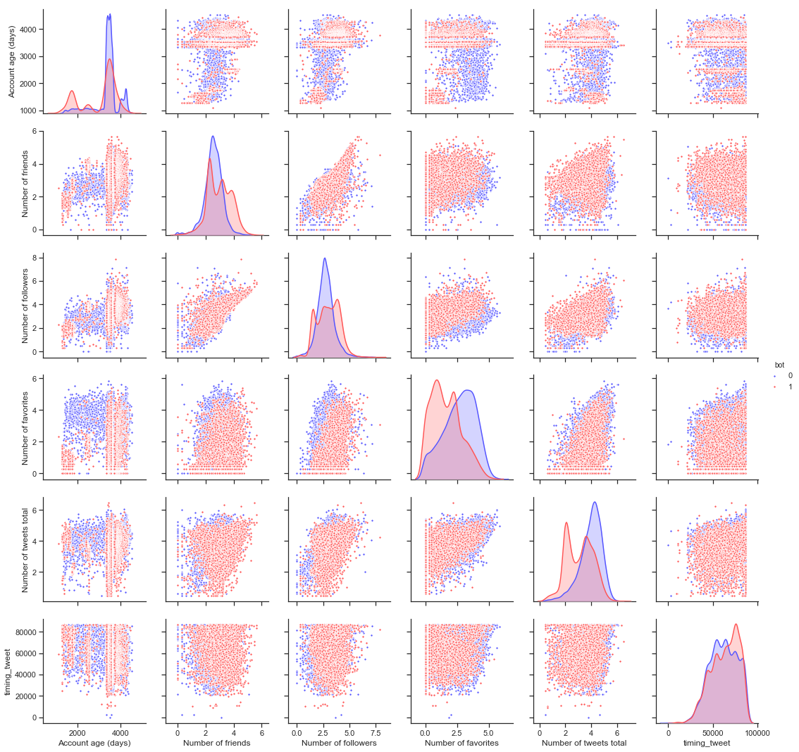


## Helpers via Python Classes

In the section of code below, we essentially write a class SklearnHelper that allows one to extend the inbuilt methods (such as train, predict and fit) common to all the Sklearn classifiers. Therefore this cuts out redundancy as won't need to write the same methods five times if we wanted to invoke five different classifiers.


```python
# Some useful parameters which will come in handy later on
ntrain = X_train_scaled.shape[0]
ntest = X_test_scaled.shape[0]
SEED = 99 # for reproducibility
NFOLDS = 5 # set folds for out-of-fold prediction

kf = KFold(n_splits = NFOLDS, random_state=SEED)

# Class to extend the Sklearn classifier
class SklearnHelper(object):
    def __init__(self, clf, seed=0, params=None):
        params['random_state'] = seed
        self.clf = clf(**params)

    def train(self, x_train, y_train):
        self.clf.fit(x_train, y_train)

    def predict(self, x):
        return self.clf.predict(x)
    
    def fit(self,x,y):
        return self.clf.fit(x,y)
    
    def feature_importances(self,x,y):
            print(self.clf.fit(x,y).feature_importances_)
    
# Class to extend XGboost classifer
```


**def init :** Python standard for invoking the default constructor for the class. This means that when you want to create an object (classifier), you have to give it the parameters of clf (what sklearn classifier you want), seed (random seed) and params (parameters for the classifiers).

The rest of the code are simply methods of the class which simply call the corresponding methods already existing within the sklearn classifiers. Essentially, we have created a wrapper class to extend the various Sklearn classifiers so that this should help us reduce having to write the same code over and over when we implement multiple learners to our stacker.

### Out-of-Fold Predictions

Stacking uses predictions of base classifiers as input for training to a second-level model. However one cannot simply train the base models on the full training data, generate predictions on the full test set and then output these for the second-level training. This runs the risk of your base model predictions already having "seen" the test set and therefore overfitting when feeding these predictions.


```python
def get_oof(clf, x_train, y_train, x_test):
    oof_train = np.zeros((ntrain,))
    oof_test = np.zeros((ntest,))
    oof_test_skf = np.empty((NFOLDS, ntest))

    for i, (train_index, test_index) in enumerate(kf.split(x_train)):

        x_tr = x_train.iloc[train_index]
        y_tr = y_train.iloc[train_index]
        x_te = x_train.iloc[test_index]
        clf.train(x_tr, y_tr)

        oof_train[test_index] = clf.predict(x_te)
        oof_test_skf[i, :] = clf.predict(x_test)

    oof_test[:] = oof_test_skf.mean(axis=0)
    return oof_train.reshape(-1, 1), oof_test.reshape(-1, 1)
```


### Generating our Base First-Level Models

So now let us prepare five learning models as our first level classification. These models can all be conveniently invoked via the Sklearn library and are listed as follows:

- **Random Forest classifier**
- **Extra Trees classifier**
- **AdaBoost classifer**
- **Gradient Boosting classifer**
- **Support Vector Machine**

**Parameters**

**n_jobs :** Number of cores used for the training process. If set to -1, all cores are used.

**n_estimators :** Number of classification trees in your learning model ( set to 10 per default)

**max_depth :** Maximum depth of tree, or how much a node should be expanded. Beware if set to too high a number would run the risk of overfitting as one would be growing the tree too deep

**verbose :** Controls whether you want to output any text during the learning process. A value of 0 suppresses all text while a value of 3 outputs the tree learning process at every iteration.


```python
# Put in our parameters for said classifiers
# Random Forest parameters
rf_params = {
    'n_jobs': -1,
    'n_estimators': 500,
     'warm_start': True, 
     #'max_features': 0.2,
    'max_depth': 6,
    'min_samples_leaf': 2,
    'max_features' : 'sqrt',
    'verbose': 0
}

# Extra Trees Parameters
et_params = {
    'n_jobs': -1,
    'n_estimators':500,
    #'max_features': 0.5,
    'max_depth': 4,
    'min_samples_leaf': 2,
    'verbose': 0
}

# AdaBoost parameters
ada_params = {
    'n_estimators': 500,
    'learning_rate' : 0.75
}

# Gradient Boosting parameters
gb_params = {
    'n_estimators': 500,
     #'max_features': 0.2,
    'max_depth': 5,
    'min_samples_leaf': 2,
    'verbose': 0
}

# Support Vector Classifier parameters 
svc_params = {
    'kernel' : 'sigmoid',
    'C' : 0.1
    }

logreg_params = {'C':100000, 'fit_intercept': True}
lda_params = {'store_covariance': True}
qda_params = {'store_covariance': True}
polylogreg_params = {}
```


Let us now create 5 objects that represent our 5 learning models via our Helper Sklearn Class we defined earlier.


```python
# Create 5 objects that represent our 4 models
rf = SklearnHelper(clf=RandomForestClassifier, seed=SEED, params=rf_params)
et = SklearnHelper(clf=ExtraTreesClassifier, seed=SEED, params=et_params)
ada = SklearnHelper(clf=AdaBoostClassifier, seed=SEED, params=ada_params)
gb = SklearnHelper(clf=GradientBoostingClassifier, seed=SEED, params=gb_params)
svc = SklearnHelper(clf=SVC, seed=SEED, params=svc_params)
logreg_stack = SklearnHelper(clf=LogisticRegression, seed=SEED, params=logreg_params)
#lda_stack = SklearnHelper(clf=LinearDiscriminantAnalysis, params=lda_params)
#qda_stack = SklearnHelper(clf=QuadraticDiscriminantAnalysis, params=qda_params)
#polylogreg_stack = SklearnHelper(clf=polynomial_logreg_estimator, seed=SEED, params=polylogreg_params)
```


### Output of the First level Predictions

We now feed the training and test data into our 5 base classifiers and use the Out-of-Fold prediction function we defined earlier to generate our first level predictions. Allow a handful of minutes for the chunk of code below to run.


```python
# Create our OOF train and test predictions. These base results will be used as new features
et_oof_train, et_oof_test = get_oof(et, X_train_scaled, Y_train, X_test_scaled) # Extra Trees
rf_oof_train, rf_oof_test = get_oof(rf,X_train_scaled, Y_train, X_test_scaled) # Random Forest
ada_oof_train, ada_oof_test = get_oof(ada, X_train_scaled, Y_train, X_test_scaled) # AdaBoost 
gb_oof_train, gb_oof_test = get_oof(gb,X_train_scaled, Y_train, X_test_scaled) # Gradient Boost
svc_oof_train, svc_oof_test = get_oof(svc,X_train_scaled, Y_train, X_test_scaled) # Support Vector Classifier
logreg_oof_train, logreg_oof_test = get_oof(logreg_stack,X_train_scaled, Y_train, X_test_scaled) # Linear Logistic Regression
#lda_oof_train, lda_oof_test = get_oof(lda_stack,X_train_scaled, Y_train, X_test_scaled) # LDA
#qda_oof_train, qda_oof_test = get_oof(qda_stack,X_train_scaled, Y_train, X_test_scaled) # QDA
#polylogreg_oof_train, polylogreg_oof_test = get_oof(polylogreg_stack,X_train_scaled, Y_train, X_test_scaled) # Polynomial Logistic Regression

print("Training is complete")
```


    Training is complete
    

### Feature importances generated from the different classifiers

Now having learned our the first-level classifiers, we can utilise a very nifty feature of the Sklearn models and that is to output the importances of the various features in the training and test sets with one very simple line of code.

As per the Sklearn documentation, most of the classifiers are built in with an attribute which returns feature importances by simply typing in .featureimportances. Therefore we will invoke this very useful attribute via our function earliand plot the feature importances as such


```python
rf_feature = rf.feature_importances(X_train_scaled,Y_train);
et_feature = et.feature_importances(X_train_scaled, Y_train);
ada_feature = ada.feature_importances(X_train_scaled, Y_train);
gb_feature = gb.feature_importances(X_train_scaled,Y_train);
```


    [0.01040077 0.00271345 0.02571925 0.00269657 0.00062294 0.11067271
     0.00524144 0.19651664 0.15383554 0.22888341 0.13083209 0.11240919
     0.01945599]
    [0.1851489  0.02698042 0.11626441 0.02168347 0.00496865 0.31242358
     0.02762129 0.07809107 0.00762381 0.07623999 0.04850533 0.06264847
     0.03180063]
    [0.008 0.014 0.012 0.002 0.    0.666 0.016 0.06  0.038 0.03  0.06  0.06
     0.034]
    [5.58484420e-03 2.58457182e-03 6.06856077e-03 1.18974807e-03
     1.64445226e-04 2.16018516e-01 2.26869048e-03 2.54855733e-01
     1.05620892e-01 2.65655795e-01 7.26437428e-02 5.64419007e-02
     1.09025601e-02]
    


```python
rf_feature = [0.01040077, 0.00271345, 0.02571925, 0.00269657, 0.00062294, 0.11067271, 0.00524144,
              0.19651664, 0.15383554, 0.22888341, 0.13083209, 0.11240919, 0.01945599]
et_feature = [0.1851489,  0.02698042, 0.11626441, 0.02168347, 0.00496865, 0.31242358, 0.02762129,
              0.07809107, 0.00762381, 0.07623999, 0.04850533, 0.06264847, 0.03180063]
ada_feature = [0.008, 0.014, 0.012, 0.002, 0.,    0.666, 0.016, 0.06,  0.038, 0.03,  0.06,  0.06, 0.034]
gb_feature = [5.58484420e-03, 2.58457182e-03, 6.06856077e-03, 1.18974807e-03, 1.64445226e-04,
              2.16018516e-01, 2.26869048e-03, 2.54855733e-01, 1.05620892e-01, 2.65655795e-01,
              7.26437428e-02, 5.64419007e-02, 1.09025601e-02]
```


```python
cols = X_train_scaled.columns.values
display(cols)
# Create a dataframe with features
feature_dataframe = pd.DataFrame( {'features': cols,
     'Random Forest feature importances': rf_feature,
     'Extra Trees  feature importances': et_feature,
      'AdaBoost feature importances': ada_feature,
    'Gradient Boost feature importances': gb_feature
    })

feature_dataframe
```


    array(['Screen name length', 'Number of digits in screen name',
           'User name length', 'Default profile (binary)',
           'Default picture (binary)', 'Account age (days)',
           'Number of unique profile descriptions', 'Number of friends',
           'Number of followers', 'Number of favorites',
           'Number of tweets per hour', 'Number of tweets total',
           'timing_tweet'], dtype=object)


<div>
<style scoped>
    .dataframe tbody tr th:only-of-type {
        vertical-align: middle;
    }

    .dataframe tbody tr th {
        vertical-align: top;
    }

    .dataframe thead th {
        text-align: right;
    }
</style>
<table border="1" class="dataframe">
  <thead>
    <tr style="text-align: right;">
      <th></th>
      <th>AdaBoost feature importances</th>
      <th>Extra Trees  feature importances</th>
      <th>Gradient Boost feature importances</th>
      <th>Random Forest feature importances</th>
      <th>features</th>
    </tr>
  </thead>
  <tbody>
    <tr>
      <th>0</th>
      <td>0.008</td>
      <td>0.185149</td>
      <td>0.005585</td>
      <td>0.010401</td>
      <td>Screen name length</td>
    </tr>
    <tr>
      <th>1</th>
      <td>0.014</td>
      <td>0.026980</td>
      <td>0.002585</td>
      <td>0.002713</td>
      <td>Number of digits in screen name</td>
    </tr>
    <tr>
      <th>2</th>
      <td>0.012</td>
      <td>0.116264</td>
      <td>0.006069</td>
      <td>0.025719</td>
      <td>User name length</td>
    </tr>
    <tr>
      <th>3</th>
      <td>0.002</td>
      <td>0.021683</td>
      <td>0.001190</td>
      <td>0.002697</td>
      <td>Default profile (binary)</td>
    </tr>
    <tr>
      <th>4</th>
      <td>0.000</td>
      <td>0.004969</td>
      <td>0.000164</td>
      <td>0.000623</td>
      <td>Default picture (binary)</td>
    </tr>
    <tr>
      <th>5</th>
      <td>0.666</td>
      <td>0.312424</td>
      <td>0.216019</td>
      <td>0.110673</td>
      <td>Account age (days)</td>
    </tr>
    <tr>
      <th>6</th>
      <td>0.016</td>
      <td>0.027621</td>
      <td>0.002269</td>
      <td>0.005241</td>
      <td>Number of unique profile descriptions</td>
    </tr>
    <tr>
      <th>7</th>
      <td>0.060</td>
      <td>0.078091</td>
      <td>0.254856</td>
      <td>0.196517</td>
      <td>Number of friends</td>
    </tr>
    <tr>
      <th>8</th>
      <td>0.038</td>
      <td>0.007624</td>
      <td>0.105621</td>
      <td>0.153836</td>
      <td>Number of followers</td>
    </tr>
    <tr>
      <th>9</th>
      <td>0.030</td>
      <td>0.076240</td>
      <td>0.265656</td>
      <td>0.228883</td>
      <td>Number of favorites</td>
    </tr>
    <tr>
      <th>10</th>
      <td>0.060</td>
      <td>0.048505</td>
      <td>0.072644</td>
      <td>0.130832</td>
      <td>Number of tweets per hour</td>
    </tr>
    <tr>
      <th>11</th>
      <td>0.060</td>
      <td>0.062648</td>
      <td>0.056442</td>
      <td>0.112409</td>
      <td>Number of tweets total</td>
    </tr>
    <tr>
      <th>12</th>
      <td>0.034</td>
      <td>0.031801</td>
      <td>0.010903</td>
      <td>0.019456</td>
      <td>timing_tweet</td>
    </tr>
  </tbody>
</table>
</div>


```python
import plotly
import plotly.offline as py
py.init_notebook_mode(connected=True)
import plotly.graph_objs as go
import plotly.tools as tls
```


<script type="text/javascript">window.PlotlyConfig = {MathJaxConfig: 'local'};</script><script type="text/javascript">if (window.MathJax) {MathJax.Hub.Config({SVG: {font: "STIX-Web"}});}</script><script>requirejs.config({paths: { 'plotly': ['https://cdn.plot.ly/plotly-latest.min']},});if(!window._Plotly) {require(['plotly'],function(plotly) {window._Plotly=plotly;});}</script>


```python
# Scatter plot 
trace = go.Scatter(
    y = feature_dataframe['Random Forest feature importances'].values,
    x = feature_dataframe['features'].values,
    mode='markers',
    marker=dict(
        sizemode = 'diameter',
        sizeref = 1,
        size = 25,
#       size= feature_dataframe['AdaBoost feature importances'].values,
        #color = np.random.randn(500), #set color equal to a variable
        color = feature_dataframe['Random Forest feature importances'].values,
        colorscale='Portland',
        showscale=True
    ),
    text = feature_dataframe['features'].values
)
data = [trace]


layout= go.Layout(
    autosize= True,
    title= 'Random Forest Feature Importance',
    hovermode= 'closest',
#     xaxis= dict(
#         title= 'Pop',
#         ticklen= 5,
#         zeroline= False,
#         gridwidth= 2,
#     ),
    yaxis=dict(
        title= 'Feature Importance',
        ticklen= 5,
        gridwidth= 2
    ),
    showlegend= False
)
fig = go.Figure(data=data, layout=layout)
py.iplot(fig,filename='scatter2010')

# Scatter plot 
trace = go.Scatter(
    y = feature_dataframe['Extra Trees  feature importances'].values,
    x = feature_dataframe['features'].values,
    mode='markers',
    marker=dict(
        sizemode = 'diameter',
        sizeref = 1,
        size = 25,
#       size= feature_dataframe['AdaBoost feature importances'].values,
        #color = np.random.randn(500), #set color equal to a variable
        color = feature_dataframe['Extra Trees  feature importances'].values,
        colorscale='Portland',
        showscale=True
    ),
    text = feature_dataframe['features'].values
)
data = [trace]

layout= go.Layout(
    autosize= True,
    title= 'Extra Trees Feature Importance',
    hovermode= 'closest',
#     xaxis= dict(
#         title= 'Pop',
#         ticklen= 5,
#         zeroline= False,
#         gridwidth= 2,
#     ),
    yaxis=dict(
        title= 'Feature Importance',
        ticklen= 5,
        gridwidth= 2
    ),
    showlegend= False
)
fig = go.Figure(data=data, layout=layout)
py.iplot(fig,filename='scatter2010')

# Scatter plot 
trace = go.Scatter(
    y = feature_dataframe['AdaBoost feature importances'].values,
    x = feature_dataframe['features'].values,
    mode='markers',
    marker=dict(
        sizemode = 'diameter',
        sizeref = 1,
        size = 25,
#       size= feature_dataframe['AdaBoost feature importances'].values,
        #color = np.random.randn(500), #set color equal to a variable
        color = feature_dataframe['AdaBoost feature importances'].values,
        colorscale='Portland',
        showscale=True
    ),
    text = feature_dataframe['features'].values
)
data = [trace]

layout= go.Layout(
    autosize= True,
    title= 'AdaBoost Feature Importance',
    hovermode= 'closest',
#     xaxis= dict(
#         title= 'Pop',
#         ticklen= 5,
#         zeroline= False,
#         gridwidth= 2,
#     ),
    yaxis=dict(
        title= 'Feature Importance',
        ticklen= 5,
        gridwidth= 2
    ),
    showlegend= False
)
fig = go.Figure(data=data, layout=layout)
py.iplot(fig,filename='scatter2010')

# Scatter plot 
trace = go.Scatter(
    y = feature_dataframe['Gradient Boost feature importances'].values,
    x = feature_dataframe['features'].values,
    mode='markers',
    marker=dict(
        sizemode = 'diameter',
        sizeref = 1,
        size = 25,
#       size= feature_dataframe['AdaBoost feature importances'].values,
        #color = np.random.randn(500), #set color equal to a variable
        color = feature_dataframe['Gradient Boost feature importances'].values,
        colorscale='Portland',
        showscale=True
    ),
    text = feature_dataframe['features'].values
)
data = [trace]

layout= go.Layout(
    autosize= True,
    title= 'Gradient Boosting Feature Importance',
    hovermode= 'closest',
#     xaxis= dict(
#         title= 'Pop',
#         ticklen= 5,
#         zeroline= False,
#         gridwidth= 2,
#     ),
    yaxis=dict(
        title= 'Feature Importance',
        ticklen= 5,
        gridwidth= 2
    ),
    showlegend= False
)
fig = go.Figure(data=data, layout=layout)
py.iplot(fig,filename='scatter2010')
```


<div id="0951e065-9b3e-4771-96d9-abec8f15c824" style="height: 525px; width: 100%;" class="plotly-graph-div"></div><script type="text/javascript">require(["plotly"], function(Plotly) { window.PLOTLYENV=window.PLOTLYENV || {};window.PLOTLYENV.BASE_URL="https://plot.ly";Plotly.newPlot("0951e065-9b3e-4771-96d9-abec8f15c824", [{"marker": {"color": [0.01040077, 0.00271345, 0.02571925, 0.00269657, 0.00062294, 0.11067271, 0.00524144, 0.19651664, 0.15383554, 0.22888341, 0.13083209, 0.11240919, 0.01945599], "colorscale": "Portland", "showscale": true, "size": 25, "sizemode": "diameter", "sizeref": 1}, "mode": "markers", "text": ["Screen name length", "Number of digits in screen name", "User name length", "Default profile (binary)", "Default picture (binary)", "Account age (days)", "Number of unique profile descriptions", "Number of friends", "Number of followers", "Number of favorites", "Number of tweets per hour", "Number of tweets total", "timing_tweet"], "x": ["Screen name length", "Number of digits in screen name", "User name length", "Default profile (binary)", "Default picture (binary)", "Account age (days)", "Number of unique profile descriptions", "Number of friends", "Number of followers", "Number of favorites", "Number of tweets per hour", "Number of tweets total", "timing_tweet"], "y": [0.01040077, 0.00271345, 0.02571925, 0.00269657, 0.00062294, 0.11067271, 0.00524144, 0.19651664, 0.15383554, 0.22888341, 0.13083209, 0.11240919, 0.01945599], "type": "scatter", "uid": "cb2daf4f-ee53-467a-9265-27ecf778bc7e"}], {"autosize": true, "hovermode": "closest", "showlegend": false, "title": "Random Forest Feature Importance", "yaxis": {"gridwidth": 2, "ticklen": 5, "title": "Feature Importance"}}, {"showLink": true, "linkText": "Export to plot.ly", "plotlyServerURL": "https://plot.ly"})});</script><script type="text/javascript">window.addEventListener("resize", function(){window._Plotly.Plots.resize(document.getElementById("0951e065-9b3e-4771-96d9-abec8f15c824"));});</script>


<div id="5ea11e12-13bc-4e34-af5e-86866866299c" style="height: 525px; width: 100%;" class="plotly-graph-div"></div><script type="text/javascript">require(["plotly"], function(Plotly) { window.PLOTLYENV=window.PLOTLYENV || {};window.PLOTLYENV.BASE_URL="https://plot.ly";Plotly.newPlot("5ea11e12-13bc-4e34-af5e-86866866299c", [{"marker": {"color": [0.1851489, 0.02698042, 0.11626441, 0.02168347, 0.00496865, 0.31242358, 0.02762129, 0.07809107, 0.00762381, 0.07623999, 0.04850533, 0.06264847, 0.03180063], "colorscale": "Portland", "showscale": true, "size": 25, "sizemode": "diameter", "sizeref": 1}, "mode": "markers", "text": ["Screen name length", "Number of digits in screen name", "User name length", "Default profile (binary)", "Default picture (binary)", "Account age (days)", "Number of unique profile descriptions", "Number of friends", "Number of followers", "Number of favorites", "Number of tweets per hour", "Number of tweets total", "timing_tweet"], "x": ["Screen name length", "Number of digits in screen name", "User name length", "Default profile (binary)", "Default picture (binary)", "Account age (days)", "Number of unique profile descriptions", "Number of friends", "Number of followers", "Number of favorites", "Number of tweets per hour", "Number of tweets total", "timing_tweet"], "y": [0.1851489, 0.02698042, 0.11626441, 0.02168347, 0.00496865, 0.31242358, 0.02762129, 0.07809107, 0.00762381, 0.07623999, 0.04850533, 0.06264847, 0.03180063], "type": "scatter", "uid": "afeb5361-d886-4ab5-a81e-0945ace32597"}], {"autosize": true, "hovermode": "closest", "showlegend": false, "title": "Extra Trees Feature Importance", "yaxis": {"gridwidth": 2, "ticklen": 5, "title": "Feature Importance"}}, {"showLink": true, "linkText": "Export to plot.ly", "plotlyServerURL": "https://plot.ly"})});</script><script type="text/javascript">window.addEventListener("resize", function(){window._Plotly.Plots.resize(document.getElementById("5ea11e12-13bc-4e34-af5e-86866866299c"));});</script>


<div id="8f077645-f8d2-41d0-9e63-2e9aa9d4c72a" style="height: 525px; width: 100%;" class="plotly-graph-div"></div><script type="text/javascript">require(["plotly"], function(Plotly) { window.PLOTLYENV=window.PLOTLYENV || {};window.PLOTLYENV.BASE_URL="https://plot.ly";Plotly.newPlot("8f077645-f8d2-41d0-9e63-2e9aa9d4c72a", [{"marker": {"color": [0.008, 0.014, 0.012, 0.002, 0.0, 0.666, 0.016, 0.06, 0.038, 0.03, 0.06, 0.06, 0.034], "colorscale": "Portland", "showscale": true, "size": 25, "sizemode": "diameter", "sizeref": 1}, "mode": "markers", "text": ["Screen name length", "Number of digits in screen name", "User name length", "Default profile (binary)", "Default picture (binary)", "Account age (days)", "Number of unique profile descriptions", "Number of friends", "Number of followers", "Number of favorites", "Number of tweets per hour", "Number of tweets total", "timing_tweet"], "x": ["Screen name length", "Number of digits in screen name", "User name length", "Default profile (binary)", "Default picture (binary)", "Account age (days)", "Number of unique profile descriptions", "Number of friends", "Number of followers", "Number of favorites", "Number of tweets per hour", "Number of tweets total", "timing_tweet"], "y": [0.008, 0.014, 0.012, 0.002, 0.0, 0.666, 0.016, 0.06, 0.038, 0.03, 0.06, 0.06, 0.034], "type": "scatter", "uid": "8ed23aff-a343-43a3-b013-b2ba010cd79e"}], {"autosize": true, "hovermode": "closest", "showlegend": false, "title": "AdaBoost Feature Importance", "yaxis": {"gridwidth": 2, "ticklen": 5, "title": "Feature Importance"}}, {"showLink": true, "linkText": "Export to plot.ly", "plotlyServerURL": "https://plot.ly"})});</script><script type="text/javascript">window.addEventListener("resize", function(){window._Plotly.Plots.resize(document.getElementById("8f077645-f8d2-41d0-9e63-2e9aa9d4c72a"));});</script>


<div id="ec12e87c-3f10-475d-9aec-40a72938f3cc" style="height: 525px; width: 100%;" class="plotly-graph-div"></div><script type="text/javascript">require(["plotly"], function(Plotly) { window.PLOTLYENV=window.PLOTLYENV || {};window.PLOTLYENV.BASE_URL="https://plot.ly";Plotly.newPlot("ec12e87c-3f10-475d-9aec-40a72938f3cc", [{"marker": {"color": [0.0055848442, 0.00258457182, 0.00606856077, 0.00118974807, 0.000164445226, 0.216018516, 0.00226869048, 0.254855733, 0.105620892, 0.265655795, 0.0726437428, 0.0564419007, 0.0109025601], "colorscale": "Portland", "showscale": true, "size": 25, "sizemode": "diameter", "sizeref": 1}, "mode": "markers", "text": ["Screen name length", "Number of digits in screen name", "User name length", "Default profile (binary)", "Default picture (binary)", "Account age (days)", "Number of unique profile descriptions", "Number of friends", "Number of followers", "Number of favorites", "Number of tweets per hour", "Number of tweets total", "timing_tweet"], "x": ["Screen name length", "Number of digits in screen name", "User name length", "Default profile (binary)", "Default picture (binary)", "Account age (days)", "Number of unique profile descriptions", "Number of friends", "Number of followers", "Number of favorites", "Number of tweets per hour", "Number of tweets total", "timing_tweet"], "y": [0.0055848442, 0.00258457182, 0.00606856077, 0.00118974807, 0.000164445226, 0.216018516, 0.00226869048, 0.254855733, 0.105620892, 0.265655795, 0.0726437428, 0.0564419007, 0.0109025601], "type": "scatter", "uid": "497d8821-921c-4e7c-b4ac-abc2d252a572"}], {"autosize": true, "hovermode": "closest", "showlegend": false, "title": "Gradient Boosting Feature Importance", "yaxis": {"gridwidth": 2, "ticklen": 5, "title": "Feature Importance"}}, {"showLink": true, "linkText": "Export to plot.ly", "plotlyServerURL": "https://plot.ly"})});</script><script type="text/javascript">window.addEventListener("resize", function(){window._Plotly.Plots.resize(document.getElementById("ec12e87c-3f10-475d-9aec-40a72938f3cc"));});</script>


```python
# Create the new column containing the average of values
feature_dataframe['mean'] = feature_dataframe.mean(axis= 1) # axis = 1 computes the mean row-wise
feature_dataframe.head(3)
```


<div>
<style scoped>
    .dataframe tbody tr th:only-of-type {
        vertical-align: middle;
    }

    .dataframe tbody tr th {
        vertical-align: top;
    }

    .dataframe thead th {
        text-align: right;
    }
</style>
<table border="1" class="dataframe">
  <thead>
    <tr style="text-align: right;">
      <th></th>
      <th>AdaBoost feature importances</th>
      <th>Extra Trees  feature importances</th>
      <th>Gradient Boost feature importances</th>
      <th>Random Forest feature importances</th>
      <th>features</th>
      <th>mean</th>
    </tr>
  </thead>
  <tbody>
    <tr>
      <th>0</th>
      <td>0.008</td>
      <td>0.185149</td>
      <td>0.005585</td>
      <td>0.010401</td>
      <td>Screen name length</td>
      <td>0.052284</td>
    </tr>
    <tr>
      <th>1</th>
      <td>0.014</td>
      <td>0.026980</td>
      <td>0.002585</td>
      <td>0.002713</td>
      <td>Number of digits in screen name</td>
      <td>0.011570</td>
    </tr>
    <tr>
      <th>2</th>
      <td>0.012</td>
      <td>0.116264</td>
      <td>0.006069</td>
      <td>0.025719</td>
      <td>User name length</td>
      <td>0.040013</td>
    </tr>
  </tbody>
</table>
</div>


### Plotly Barplot of Average Feature Importances

Having obtained the mean feature importance across all our classifiers, we can plot them into a Plotly bar plot as follows:


```python
y = feature_dataframe['mean'].values
x = feature_dataframe['features'].values
data = [go.Bar(
            x= x,
             y= y,
            width = 0.5,
            marker=dict(
               color = feature_dataframe['mean'].values,
            colorscale='Portland',
            showscale=True,
            reversescale = False
            ),
            opacity=0.6
        )]

layout= go.Layout(
    autosize= True,
    title= 'Barplots of Mean Feature Importance',
    hovermode= 'closest',
#     xaxis= dict(
#         title= 'Pop',
#         ticklen= 5,
#         zeroline= False,
#         gridwidth= 2,
#     ),
    yaxis=dict(
        title= 'Feature Importance',
        ticklen= 5,
        gridwidth= 2
    ),
    showlegend= False
)
fig = go.Figure(data=data, layout=layout)
py.iplot(fig, filename='bar-direct-labels')
```


<div id="acd04579-081d-4775-81d5-720a6de96a4e" style="height: 525px; width: 100%;" class="plotly-graph-div"></div><script type="text/javascript">require(["plotly"], function(Plotly) { window.PLOTLYENV=window.PLOTLYENV || {};window.PLOTLYENV.BASE_URL="https://plot.ly";Plotly.newPlot("acd04579-081d-4775-81d5-720a6de96a4e", [{"marker": {"color": [0.05228362855, 0.011569610455, 0.0400130551925, 0.006892447017499999, 0.0014390088065, 0.3262787015, 0.01278285512, 0.14736586075, 0.0762700605, 0.15019479875, 0.0779952907, 0.072874890175, 0.024039795024999998], "colorscale": "Portland", "reversescale": false, "showscale": true}, "opacity": 0.6, "width": 0.5, "x": ["Screen name length", "Number of digits in screen name", "User name length", "Default profile (binary)", "Default picture (binary)", "Account age (days)", "Number of unique profile descriptions", "Number of friends", "Number of followers", "Number of favorites", "Number of tweets per hour", "Number of tweets total", "timing_tweet"], "y": [0.05228362855, 0.011569610455, 0.0400130551925, 0.006892447017499999, 0.0014390088065, 0.3262787015, 0.01278285512, 0.14736586075, 0.0762700605, 0.15019479875, 0.0779952907, 0.072874890175, 0.024039795024999998], "type": "bar", "uid": "d7da44d0-cff4-48d8-9b8e-eaee246c8d1b"}], {"autosize": true, "hovermode": "closest", "showlegend": false, "title": "Barplots of Mean Feature Importance", "yaxis": {"gridwidth": 2, "ticklen": 5, "title": "Feature Importance"}}, {"showLink": true, "linkText": "Export to plot.ly", "plotlyServerURL": "https://plot.ly"})});</script><script type="text/javascript">window.addEventListener("resize", function(){window._Plotly.Plots.resize(document.getElementById("acd04579-081d-4775-81d5-720a6de96a4e"));});</script>


## Second-Level Predictions from the First-level Output

### First-level output as new features

Having now obtained our first-level predictions, one can think of it as essentially building a new set of features to be used as training data for the next classifier. As per the code below, we are therefore having as our new columns the first-level predictions from our earlier classifiers and we train the next classifier on this.


```python
base_predictions_train = pd.DataFrame( {'RandomForest': rf_oof_train.ravel(),
     'ExtraTrees': et_oof_train.ravel(),
     'AdaBoost': ada_oof_train.ravel(),
      'GradientBoost': gb_oof_train.ravel(),
        'Logistic Regression': logreg_oof_train.ravel()
    })
display(base_predictions_train.head())

base_predictions_test = pd.DataFrame( {'RandomForest': rf_oof_test.ravel(),
     'ExtraTrees': et_oof_test.ravel(),
     'AdaBoost': ada_oof_test.ravel(),
      'GradientBoost': gb_oof_test.ravel(),
        'Logistic Regression': logreg_oof_test.ravel()
    })
base_predictions_test.head()

```


<div>
<style scoped>
    .dataframe tbody tr th:only-of-type {
        vertical-align: middle;
    }

    .dataframe tbody tr th {
        vertical-align: top;
    }

    .dataframe thead th {
        text-align: right;
    }
</style>
<table border="1" class="dataframe">
  <thead>
    <tr style="text-align: right;">
      <th></th>
      <th>AdaBoost</th>
      <th>ExtraTrees</th>
      <th>GradientBoost</th>
      <th>Logistic Regression</th>
      <th>RandomForest</th>
    </tr>
  </thead>
  <tbody>
    <tr>
      <th>0</th>
      <td>0.0</td>
      <td>0.0</td>
      <td>0.0</td>
      <td>0.0</td>
      <td>0.0</td>
    </tr>
    <tr>
      <th>1</th>
      <td>0.0</td>
      <td>0.0</td>
      <td>0.0</td>
      <td>0.0</td>
      <td>0.0</td>
    </tr>
    <tr>
      <th>2</th>
      <td>0.0</td>
      <td>0.0</td>
      <td>0.0</td>
      <td>0.0</td>
      <td>0.0</td>
    </tr>
    <tr>
      <th>3</th>
      <td>0.0</td>
      <td>0.0</td>
      <td>0.0</td>
      <td>0.0</td>
      <td>0.0</td>
    </tr>
    <tr>
      <th>4</th>
      <td>0.0</td>
      <td>0.0</td>
      <td>0.0</td>
      <td>0.0</td>
      <td>0.0</td>
    </tr>
  </tbody>
</table>
</div>


<div>
<style scoped>
    .dataframe tbody tr th:only-of-type {
        vertical-align: middle;
    }

    .dataframe tbody tr th {
        vertical-align: top;
    }

    .dataframe thead th {
        text-align: right;
    }
</style>
<table border="1" class="dataframe">
  <thead>
    <tr style="text-align: right;">
      <th></th>
      <th>AdaBoost</th>
      <th>ExtraTrees</th>
      <th>GradientBoost</th>
      <th>Logistic Regression</th>
      <th>RandomForest</th>
    </tr>
  </thead>
  <tbody>
    <tr>
      <th>0</th>
      <td>0.0</td>
      <td>0.0</td>
      <td>0.0</td>
      <td>0.0</td>
      <td>0.0</td>
    </tr>
    <tr>
      <th>1</th>
      <td>1.0</td>
      <td>0.0</td>
      <td>1.0</td>
      <td>1.0</td>
      <td>1.0</td>
    </tr>
    <tr>
      <th>2</th>
      <td>0.0</td>
      <td>0.0</td>
      <td>0.0</td>
      <td>0.0</td>
      <td>0.0</td>
    </tr>
    <tr>
      <th>3</th>
      <td>1.0</td>
      <td>0.0</td>
      <td>1.0</td>
      <td>0.0</td>
      <td>0.0</td>
    </tr>
    <tr>
      <th>4</th>
      <td>0.0</td>
      <td>0.0</td>
      <td>0.0</td>
      <td>0.0</td>
      <td>0.0</td>
    </tr>
  </tbody>
</table>
</div>


### Correlation Heatmap of the Second Level Training set


```python
data = [
    go.Heatmap(
        z= base_predictions_train.astype(float).corr().values ,
        x=base_predictions_train.columns.values,
        y= base_predictions_train.columns.values,
          colorscale='Viridis',
            showscale=True,
            reversescale = True
    )
]
py.iplot(data, filename='labelled-heatmap')
```


<div id="f671a1b5-41da-4dcc-8e27-fa0b7787f7af" style="height: 525px; width: 100%;" class="plotly-graph-div"></div><script type="text/javascript">require(["plotly"], function(Plotly) { window.PLOTLYENV=window.PLOTLYENV || {};window.PLOTLYENV.BASE_URL="https://plot.ly";Plotly.newPlot("f671a1b5-41da-4dcc-8e27-fa0b7787f7af", [{"colorscale": "Viridis", "reversescale": true, "showscale": true, "x": ["AdaBoost", "ExtraTrees", "GradientBoost", "Logistic Regression", "RandomForest"], "y": ["AdaBoost", "ExtraTrees", "GradientBoost", "Logistic Regression", "RandomForest"], "z": [[1.0, 0.4559080134594197, 0.9150387522621493, 0.5847178090204851, 0.8321541628801644], [0.4559080134594197, 1.0, 0.45190916367069717, 0.6175688026868718, 0.4766534320548621], [0.9150387522621493, 0.45190916367069717, 1.0, 0.5696372365346719, 0.8449251609186822], [0.5847178090204851, 0.6175688026868718, 0.5696372365346719, 1.0, 0.6275233207195023], [0.8321541628801644, 0.4766534320548621, 0.8449251609186822, 0.6275233207195023, 1.0]], "type": "heatmap", "uid": "dee2e024-84d0-4efb-9a55-8969be03c32b"}], {}, {"showLink": true, "linkText": "Export to plot.ly", "plotlyServerURL": "https://plot.ly"})});</script><script type="text/javascript">window.addEventListener("resize", function(){window._Plotly.Plots.resize(document.getElementById("f671a1b5-41da-4dcc-8e27-fa0b7787f7af"));});</script>


```python
#x_train = np.concatenate(( rf_oof_train, ada_oof_train, gb_oof_train, svc_oof_train, logreg_oof_train), axis=1)
#x_test = np.concatenate(( rf_oof_test, ada_oof_test, gb_oof_test, svc_oof_test, logreg_oof_test), axis=1)
#x_train = base_predictions_train.mean(axis=1)
#x_test = base_predictions_test.mean(axis=1)
x_train = np.concatenate((0.4*ada_oof_train, 0.2*svc_oof_train, 0.2*rf_oof_train, 0.35*logreg_oof_train), axis=1)
x_test = np.concatenate((0.4*ada_oof_test, 0.2*svc_oof_test, 0.2*rf_oof_test, 0.35*logreg_oof_test), axis=1)
x_train = x_train.mean(axis=1).reshape(-1,1)
x_test = x_test.mean(axis=1).reshape(-1,1)
```


There have been quite a few articles and Kaggle competition winner stories about the merits of having trained models that are more uncorrelated with one another producing better scores. Having now concatenated and joined both the first-level train and test predictions as x_train and x_test, we can now fit a second-level learning model.

### Second level learning model via XGBoost

Here we choose the eXtremely famous library for boosted tree learning model, XGBoost. It was built to optimize large-scale boosted tree algorithms. For further information about the algorithm, check out the official documentation.

Anyways, we call an XGBClassifier and fit it to the first-level train and target data and use the learned model to predict the test data as follows:


```python
import xgboost as xgb
gbm = xgb.XGBClassifier(
    learning_rate = 0.001,
 n_estimators= 1000,
 max_depth= 5,
 min_child_weight= 1,
 gamma=0.8,                      
 subsample=0.7,
 colsample_bytree=0.9,
 objective= 'binary:hinge',
 nthread= -1,
 scale_pos_weight=1).fit(x_train, Y_train)
predictions = gbm.predict(x_test)
```


Just a quick run down of the XGBoost parameters used in the model:

**max_depth :** How deep you want to grow your tree. Beware if set to too high a number might run the risk of overfitting.

**gamma :** minimum loss reduction required to make a further partition on a leaf node of the tree. The larger, the more conservative the algorithm will be.

**eta :** step size shrinkage used in each boosting step to prevent overfitting


```python
gbm_train = gbm.score(x_train, Y_train)
gbm_test = gbm.score(x_test, Y_test)
print(gbm_test)
```


    0.9286866731203615
    

## Blending

In this section we utilize the `mlens` package to develop a blended ensemble with 3 layers and more than 20 different classification techniques in order to achieve a truly superior predictive capability to the previous models. The blended model is also surprisingly fast given that it contains so many different methods, including many not previously discussed in AC209a such as gaussian process classifiers, MLP classifiers, extremely randomized tree classifiers, naive Bayes classifiers, and more.

The purpose of showing the blended model is to see what happens when you (quite literally) throw everything you have at the problem and see how well you do. In this case, we do surprisingly well, but trying to optimize the hyperparameters of this model would be a truly daunting task, and there is essentially no interpretability in this model. It is purely to obtain maximal accuracy for the given input data.


```python
import xgboost as xgb
from sklearn.ensemble import VotingClassifier
from sklearn.cluster import KMeans
from mlens.ensemble import BlendEnsemble
from sklearn.ensemble import ExtraTreesClassifier
from sklearn.tree import DecisionTreeClassifier
from sklearn.ensemble import GradientBoostingRegressor
from xgboost import XGBRegressor
from sklearn.neural_network import MLPClassifier
from sklearn.gaussian_process import GaussianProcessClassifier
from sklearn.naive_bayes import GaussianNB
from sklearn.svm import SVR
from sklearn.ensemble import RandomForestClassifier

ensemble = BlendEnsemble()
ensemble.add([SVR(C=.1), RandomForestClassifier(n_estimators=200, random_state=SEED), LogisticRegression(C=1),  ExtraTreesClassifier(max_depth=10,random_state=SEED), GradientBoostingClassifier(random_state=SEED), AdaBoostClassifier(random_state=SEED)])
#ensemble.add([SVC(C=1),GaussianProcessClassifier(random_state=SEED),LogisticRegression(C=1000000), GradientBoostingClassifier(random_state=SEED), AdaBoostClassifier(random_state=SEED)])
#ensemble.add([ RandomForestClassifier(n_estimators=100, random_state=SEED), GradientBoostingClassifier(random_state=SEED),GaussianProcessClassifier(random_state=SEED)])
#ensemble.add([SVC(C=1), AdaBoostClassifier(random_state=SEED)])
ensemble.add([xgb.XGBClassifier(random_state=SEED), RandomForestClassifier(n_estimators=200, random_state=SEED), GradientBoostingClassifier(random_state=SEED)])
ensemble.add_meta(xgb.XGBClassifier(random_state=SEED))

ensemble.fit(X_train_scaled, Y_train)
preds = ensemble.predict(X_test_scaled)
ensemble_test = accuracy_score(Y_test, preds)
ensemble_train = accuracy_score(Y_train, ensemble.predict(X_train_scaled))
print(ensemble_test)
```


    0.9474023878670539
    

## Summary of Models

The following dataframe shows each of the tested models and its corresponding accuracy on the testing set.


```python
dict_var = {#"training time": [dec_1_fit_time,random_1_fit_time,model_1_fit_time,model_xg1_fit_time,clf_1_fit_time,cat_1_fit_time],
            #"inference time": [dec_1_predict_time,random_1_predict_time,model_1_predict_time,model_xg1_predict_time,clf_1_predict_time,cat_1_predict_time],
            "test accuracy": [logreg_test, linearLogCVpoly_test, rf_test, knn_best_k_test ,lda_test,qda_test, adaboost_test, xgb_test, gbm_test, ensemble_test],
            "training accuracy": [logreg_train, linearLogCVpoly_train, rf_train, knn_best_k_train ,lda_train,qda_train, adaboost_train, xgb_train, gbm_train, ensemble_train],
            #"Cross validation": ['No','No','No','No','No','No']
           }
print("Performance comparison of the six methods:")
df_var = pd.DataFrame.from_dict(dict_var)
df_var.index= ['Linear LR', 'Polynomial LR', 'Random Forest', 'kNN', 'LDA', 'QDA', 'AdaBoost', 'XGBoost', 'Stacking (2nd-Level Model)', 'Blending (3rd-Level Model)']
display(df_var)
```


    Performance comparison of the six methods:
    


<div>
<style scoped>
    .dataframe tbody tr th:only-of-type {
        vertical-align: middle;
    }

    .dataframe tbody tr th {
        vertical-align: top;
    }

    .dataframe thead th {
        text-align: right;
    }
</style>
<table border="1" class="dataframe">
  <thead>
    <tr style="text-align: right;">
      <th></th>
      <th>test accuracy</th>
      <th>training accuracy</th>
    </tr>
  </thead>
  <tbody>
    <tr>
      <th>Linear LR</th>
      <td>0.775411</td>
      <td>0.776148</td>
    </tr>
    <tr>
      <th>Polynomial LR</th>
      <td>0.800581</td>
      <td>0.808937</td>
    </tr>
    <tr>
      <th>Random Forest</th>
      <td>0.913520</td>
      <td>0.993774</td>
    </tr>
    <tr>
      <th>kNN</th>
      <td>0.718296</td>
      <td>0.772690</td>
    </tr>
    <tr>
      <th>LDA</th>
      <td>0.707648</td>
      <td>0.705728</td>
    </tr>
    <tr>
      <th>QDA</th>
      <td>0.711197</td>
      <td>0.708080</td>
    </tr>
    <tr>
      <th>AdaBoost</th>
      <td>0.945789</td>
      <td>0.987548</td>
    </tr>
    <tr>
      <th>XGBoost</th>
      <td>0.922233</td>
      <td>0.936359</td>
    </tr>
    <tr>
      <th>Stacking (2nd-Level Model)</th>
      <td>0.928687</td>
      <td>0.935667</td>
    </tr>
    <tr>
      <th>Blending (3rd-Level Model)</th>
      <td>0.947402</td>
      <td>0.954759</td>
    </tr>
  </tbody>
</table>
</div>


```python
plt.figure(figsize=(14,10))
xx = range(len(df_var))
index_name=df_var.index
plt.bar(xx, df_var['test accuracy'], color='black', alpha=0.5)
plt.ylim(0.7,1)
plt.title('Model Comparison on Test Set', fontsize=18)
plt.ylabel('Test Accuracy (%)', fontsize=16)
plt.xticks(xx,index_name,rotation=90,fontsize = 16);
sns.despine()

plt.axhline(0.95, c='k', linewidth=3, linestyle='--');
```


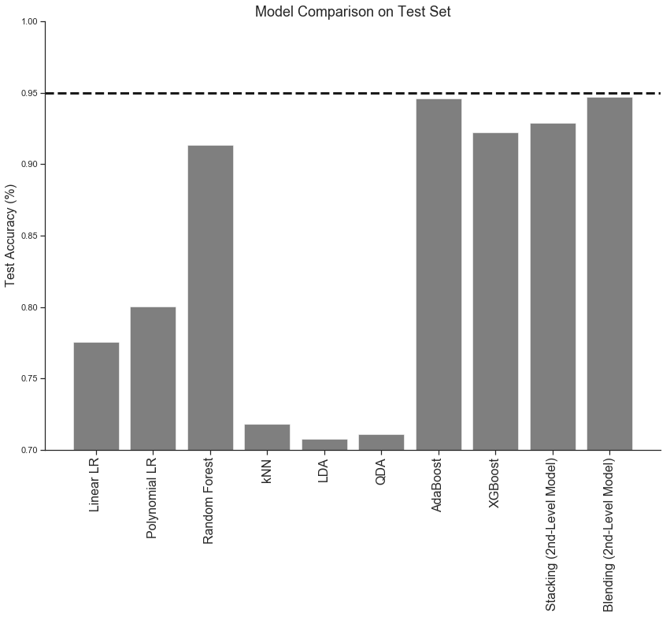


The weighted stacked model performed the best on the test set, achieving an accuracy of 85.7%, a value more than 1% higher than that achieved by the other best models: logistic regression and random forest. With extra tuning of hyperparameters and model weightings it is likely that this could be increased further.

## Netrual network


```python
from sklearn.model_selection import cross_val_score
from sklearn.utils import resample
from sklearn.tree import DecisionTreeClassifier
from sklearn.ensemble import RandomForestClassifier
from sklearn.ensemble import AdaBoostClassifier
from sklearn.linear_model import LogisticRegressionCV

import tensorflow.keras 
from tensorflow.keras import models
from tensorflow.keras import layers


from tensorflow.keras.models import Sequential
from tensorflow.keras.layers import Dense
from tensorflow.keras import regularizers

from sklearn.metrics import r2_score as r2

from sklearn.utils import shuffle
from tensorflow.keras.layers import Dropout
from tensorflow.keras.wrappers.scikit_learn import KerasClassifier

import tensorflow.contrib.eager as tfe
from sklearn.grid_search import GridSearchCV
from sklearn.datasets import make_classification
from sklearn.model_selection import cross_val_score
```


```python
model_NN = models.Sequential()

model_NN.add(layers.Dense(1000, input_shape=(X_train_scaled.shape[1],),
                activation='relu'))

model_NN.add(layers.Dense(350, input_shape=(X_train_scaled.shape[1],),
                activation='relu', 
                kernel_regularizer=regularizers.l2(0.01)))
model_NN.add(Dropout(0.5))
           
model_NN.add(layers.Dense(350,   
                activation='relu', 
                kernel_regularizer=regularizers.l2(0.01)))
model_NN.add(Dropout(0.5))


model_NN.add(layers.Dense(1,  
                activation='sigmoid')) 

model_NN.summary()
```


    _________________________________________________________________
    Layer (type)                 Output Shape              Param #   
    =================================================================
    dense (Dense)                (None, 1000)              14000     
    _________________________________________________________________
    dense_1 (Dense)              (None, 350)               350350    
    _________________________________________________________________
    dropout (Dropout)            (None, 350)               0         
    _________________________________________________________________
    dense_2 (Dense)              (None, 350)               122850    
    _________________________________________________________________
    dropout_1 (Dropout)          (None, 350)               0         
    _________________________________________________________________
    dense_3 (Dense)              (None, 1)                 351       
    =================================================================
    Total params: 487,551
    Trainable params: 487,551
    Non-trainable params: 0
    _________________________________________________________________
    


```python
tensorflow.keras.optimizers.Adam(lr=0.001, beta_1=0.9, beta_2=0.999, epsilon=None, decay=0.0, amsgrad=False)
model_NN.compile(loss='binary_crossentropy', optimizer='Adam', metrics=['accuracy'])
```


```python
%%capture
ANN_history = model_NN.fit(X_train_scaled, Y_train,batch_size=128,epochs=3000,validation_split=0.2)
```


```python
training_loss = ANN_history.history['loss']
epoch_count = range(1, len(training_loss) + 1)
plt.plot(epoch_count, training_loss, 'r--')
plt.legend(['Training Loss'])
plt.xlabel('Epoch')
plt.ylabel('Loss')
plt.show();
```


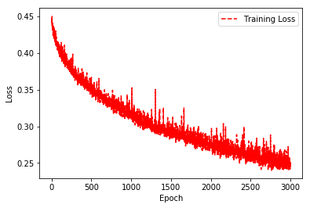


```python
fig, axs = plt.subplots(figsize=(8, 6))
plt.plot(ANN_history.history['acc'], '-o', label='train')
plt.plot(ANN_history.history['val_acc'], '-*', label='val')

plt.ylabel("Accuracy score")
plt.xlabel("Epoch")
plt.title("Accuracy score vs. Epochs")

plt.legend()
plt.show() 
```


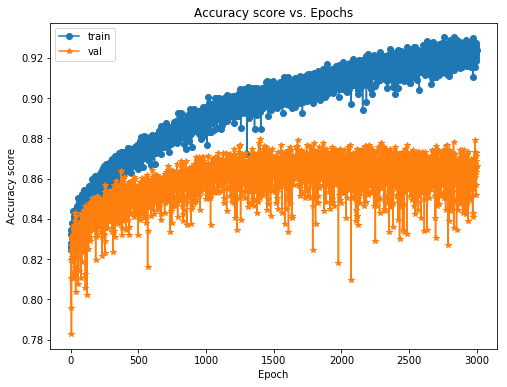


```python
test_loss,test_acc = model_NN.evaluate(X_test_scaled, Y_test, verbose=1)
print('Test loss:', test_loss)
print('Test ACC:', test_acc)
```


    3099/3099 [==============================] - 0s 88us/step
    Test loss: 0.44289736228052284
    Test ACC: 0.8725395289379845
    

### Steps for Further Improvement

As a closing remark it must be noted that the steps taken above just show a very simple way of producing an ensemble stacker. You hear of ensembles created at the highest level of Kaggle competitions which involves monstrous combinations of stacked classifiers as well as levels of stacking which go to more than 2 levels.

Some additional steps that may be taken to improve one's score could be:

- Implementing a good cross-validation strategy in training the models to find optimal parameter values
- Introduce a greater variety of base models for learning. The more uncorrelated the results, the better the final score.
